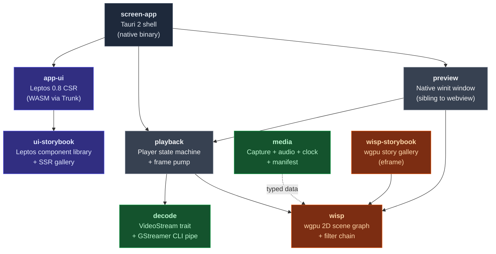
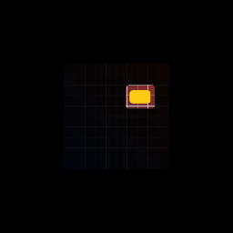
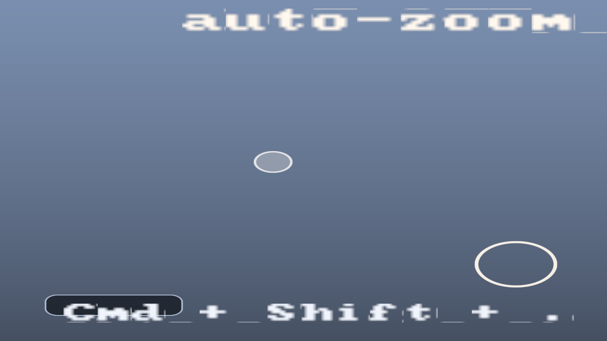
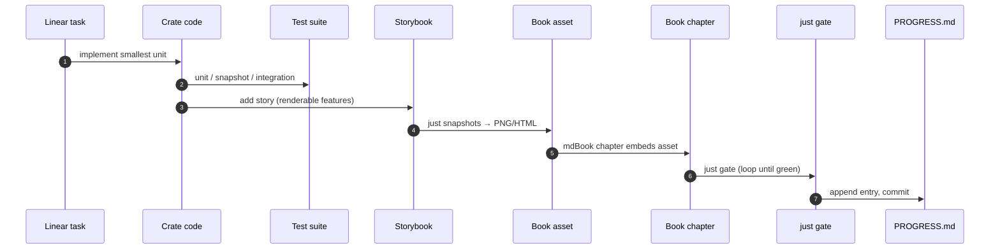

# screen

> A cinematic screen recorder in the Screen Studio / OpenScreen lineage,
> built as an all-Rust stack. Tauri 2 shell, Leptos 0.8 UI, custom wgpu
> renderer (`wisp`), GStreamer capture + decode + encode, native preview
> window. Library-first: the renderer (`wisp`) and the player
> (`playback`) are reusable in their own right.

## 📖 Documentation

The engineering site composes three mdBooks + one live WebGPU
demo into one GitHub Pages deploy:

| Site | What's there |
|---|---|
| **[Screen project book](https://eng-manager-xyz.github.io/Screen/)** | Recorder, capture, encoder, Tauri shell, Leptos UI |
| **[`wisp` library book](https://eng-manager-xyz.github.io/Screen/wisp/)** | Publishable wgpu renderer reference (Pixi-equivalent) |
| **[`wisp-chart` book](https://eng-manager-xyz.github.io/Screen/wisp-chart/)** | Grammar-of-graphics chart library — bar, line, scatter, gauge, bullet, KPI, Gantt, more |
| **[Live WebGPU chart demo](https://eng-manager-xyz.github.io/Screen/wisp-chart/demo/)** | Every chart rendering live in your browser via wgpu's `BROWSER_WEBGPU` backend. Try `?chart=line`, `?chart=bubble`, `?chart=gauge`, etc. |
| **[Rustdoc](https://eng-manager-xyz.github.io/Screen/api/)** | API reference for every crate |

## Architecture



The codebase carries a parallel **theatre metaphor** (`Stage`, `Cast`,
`Wings`, `Acts`, `Scenes`, `Rehearsal`) — the navigation language for
the project. See
[`_docs/book/src/orientation/metaphor.md`](./_docs/book/src/orientation/metaphor.md).

## What you'll see

| Crate | Hero output | Description |
|---|---|---|
| `wisp` |  | Blur + drop-shadow + color-matrix composed in one scene. |
| `wisp` text |  | Drop shadow + glow on cosmic-text glyphon-rendered text. |
| `wisp` masks |  | Spotlight composition through a vector-driven mask. |
| `media` |  | 440 Hz sine quantized to 20 bars, mirrored about the centerline. |
| `playback` + `decode` |  | Recorder mock — every wisp primitive type in one frame. |

The wgpu storybook gallery (`just storybook`) and the Leptos UI gallery
(`just ui-storybook`) render every shipped story interactively. The
mdBook chapters embed the same screenshots as anti-rot evidence — see
[Story / screenshot pipeline](./_docs/book/src/conventions/screenshots.md).

## Status

| Track | State |
|---|---|
| **`wisp` renderer (M0 + filter / mask / text / vector tracks)** | ✅ 21 + 13 + 11 + 12 chunks — all green. |
| **Tauri shell + drop-zone player (M1)** | ✅ 11 chunks. Vanilla → Leptos migration complete. |
| **Component library (`ui-storybook`)** | ✅ 40+ component stories with SSR snapshot gate. |
| **Decode → wisp pipeline (M-DEC, M-PLAY)** | ✅ `VideoStream`, `MockVideoStream`, `Player`, `GstreamerPipeStream` — real MP4 round-trip. |
| **Recorder shell + Tauri↔Leptos (M-INT.1 + .2)** | ✅ Trunk-built WASM bundle served by Tauri; OS file-drop → `CustomEvent` → Leptos signal. |
| **Native winit preview window (M-PREVIEW.1)** | ✅ Sibling window with `Application::from_wgpu`. |
| **Tauri↔player IPC (M-PLAY.2 + .3)** | ✅ Transport commands + status events + `<video>` element bound to `convertFileSrc`. |
| **Remote-first dev loop (DEV-00..08)** | ✅ `dev-server` crate + Tailscale Serve runbook. |
| **Two-book mdBook split (DOCS-00..11)** | ✅ Screen + wisp books, path-filtered CI, three-OS matrix. |
| **Media seam (M-MEDIA.0..14)** | ✅ Clock, audio chunk, histogram, A/V sync harness, video texture, synced scene. |
| **Capture (M-MEDIA.15+)** | ⏳ Live mic + webcam + screen capture wiring. |
| **Encode (M-EXPORT)** | ⏳ `appsrc → vtenc_h264_hw → mp4mux` for MP4 export. |

Full chunk-by-chunk log: [`_docs/PROGRESS.md`](./_docs/PROGRESS.md).

## Quick start

> [!IMPORTANT]
> This project pins **Rust nightly** (see `rust-toolchain.toml`); rustup
> will auto-install on first build. Tauri 2 on Linux needs gtk-rs +
> webkit2gtk dev headers; macOS needs `brew install gstreamer`; Windows
> needs WebView2 (preinstalled on Windows 11) + MSVC build tools.

### Run the recorder

```bash
git clone https://github.com/eng-manager-xyz/Screen.git
cd Screen
cd crates/app && cargo tauri dev
```

A native window titled **Screen** opens (1280×800, drag-drop enabled).
Drop any `.mp4` — the player view loads via `convertFileSrc` and plays
through the HTML5 `<video>` element bound to the native `playback`
state machine.

> [!TIP]
> The minimum cold-build path is `cargo tauri dev` from `crates/app/`
> — Tauri 2 reads `tauri.conf.json` from cwd, so running it from the
> repo root errors with `tauri.conf.json not found`. First build is
> ~2–5 min; subsequent runs are incremental.

### Manually smoke the recorder track (M-RECORDER-V0)

```bash
just test-recorder
```

One-shot clean-slate verification of the tray + AppShell + camera
picker chain shipped across the [M-RECORDER-V0 milestone](https://linear.app/harwood/issue/AUT-249)
(M-TRAY.0..4 + M-CAM.0..4 + M-REC.1). The recipe wipes the stale
`crates/app-ui/dist/` wasm bundle, removes the `screen-app` +
`app-ui` build artifacts via `cargo clean`, rebuilds the wasm
bundle through `trunk build`, and launches the Tauri binary —
making sure you're not staring at a webview loaded from a
month-old `dist/` (a real gotcha when developing the recorder
track because plain `cargo run -p screen-app` does **not**
auto-rebuild the bundle the way `cargo tauri dev` does).

> [!IMPORTANT]
> Use `just test-recorder` for **fresh-build verification**. Use
> `cd crates/app && cargo tauri dev` for **active development** —
> it has hot-reload and is much faster on the second-run-onwards.

**What you should see when the window opens:**

| Step | Expected |
|---|---|
| 1 | Small filled-circle icon on the macOS menubar (Windows tray / Linux app-indicator). |
| 2 | **Left-click tray** → 1200×720 window opens with the AppShell mounted. |
| 3 | NavigationRail on the left has 5 items (Record / Library / Editor / Cursor / Preferences). |
| 4 | **Click rail items** → right-pane swaps surfaces; URL updates to `?surface=<slug>`. |
| 5 | Recorder surface shows a **camera picker dropdown** above a 240×240 canvas. |
| 6 | **Click the dropdown** → your real attached cameras enumerate (via `gst-device-monitor-1.0`). |
| 7 | The preview canvas itself stays **blank** — the wisp pipeline body is the M-CAM.3 deferred follow-up. See [`_docs/PROGRESS.md`](_docs/PROGRESS.md) for the explicit list of deferred items. |
| 8 | **Left-click tray again** → window hides. Re-click reopens it. |

> [!NOTE]
> macOS will prompt for camera access the first time the picker
> queries `gst-device-monitor-1.0`. Grant it. The picker uses the
> permission state to drive its empty / permission-needed states.

**Total time:** ~5–8 min on a cold build (wasm + native +
GStreamer linking), ~30s warm.

### See real wisp video playback (no Tauri)

```bash
# Decode MP4 → upload to GPU → render through wisp → 7 PNGs.
cargo run -p playback --example play_file
# Output: _docs/book/src/assets/playback/playfile_NN.png
```

### Browse the galleries

```bash
just storybook       # wgpu story gallery — every wisp feature
just ui-storybook    # Leptos UI gallery — every component
just dev             # remote-friendly UI dev loop (Tailscale-ready)
```

### Build the docs site

```bash
just site            # both mdBooks + rustdoc → target/book/
just dev-book        # screen book with live reload on :3001
just dev-wisp-book   # wisp book with live reload on :3002
```

## Repository layout

| Path | Contents |
|---|---|
| `crates/app/` | Tauri 2 shell (native binary). [README](./crates/app/README.md). |
| `crates/app-ui/` | Leptos CSR app served into the webview. [README](./crates/app-ui/README.md). |
| `crates/app-e2e/` | Tier-2 WebDriver tests (Linux only). [README](./crates/app-e2e/README.md). |
| `crates/wisp/` | wgpu 2D scene graph + filter chain. [README](./crates/wisp/README.md). |
| `crates/wisp-storybook/` | wgpu story gallery + visual regression tests. [README](./crates/wisp-storybook/README.md). |
| `crates/ui-storybook/` | Leptos component library + SSR snapshot gate. [README](./crates/ui-storybook/README.md). |
| `crates/decode/` | `VideoStream` trait + GStreamer CLI pipe. [README](./crates/decode/README.md). |
| `crates/media/` | Capture + audio + clock + manifest. [README](./crates/media/README.md). |
| `crates/playback/` | `Player` state machine + frame pump. [README](./crates/playback/README.md). |
| `crates/preview/` | Native winit window for the wisp surface. [README](./crates/preview/README.md). |
| `crates/dev-server/` | axum + WebSocket live-reload + file watcher. [README](./crates/dev-server/README.md). |
| `tools/doc-gates/` | CI gates: `shared-check`, `snapshots-check`, `mermaid-check`, `required-files-check`. [README](./tools/doc-gates/README.md). |
| `tools/mdbook-preprocessor-cross/` | Cross-book mdBook preprocessor (`{{shared}}`, `{{wisp-link}}`). [README](./tools/mdbook-preprocessor-cross/README.md). |
| `_docs/book/` | Screen project mdBook (recorder / Tauri / Leptos / capture / encode). |
| `_docs/wisp-book/` | Wisp library mdBook (Pixi-shaped renderer reference). |
| `_docs/shared/` | Shared fragments used by both books via `{{shared X}}`. |
| `_docs/PROGRESS.md` | Append-only log of completed work. |
| `_docs/ISSUES.md` | Known bugs, deferrals, open questions. |
| `CLAUDE.md` | Workspace conventions + anti-patterns (auto-loaded by Claude Code). |
| `Justfile` | Every QA recipe — run `just` to list. |

## Engineering workflow

The 11-step per-task contract — see [`_docs/WORKFLOW.md`](./_docs/WORKFLOW.md)
for the canonical version:



### `just gate`

```bash
just gate    # fmt + check + lint + nextest + doctest + cargo doc +
             # snapshots-check + mermaid-check + shared-check +
             # required-files-check
```

All ten steps must pass. Failures loop until green — never disable
tests, never `#[allow]` clippy without `reason = "..."`, never bypass
`cargo deny` / `cargo audit` / `cargo machete`.

### Higher tiers

```bash
just pr           # gate + cargo deny + cargo audit + cargo machete + coverage
just docs-strict  # rustdoc with broken-link enforcement (milestone close)
just release      # pr + semver + msrv + bench + bloat + geiger
just full         # everything (slow — adds miri + mutants)
```

### CI matrix

| Runner | Role | What runs |
|---|---|---|
| `macos-latest` | **Truth runner** — Metal, no skips. | Full `just gate`. Visual snapshots canonical here. |
| `ubuntu-latest` | Linux build path. | Full `just gate` with `WISP_SKIP_GPU_FILTER_TESTS=1` (lavapipe lacks the 3 multi-bind-group filter pipelines). |
| `windows-latest` | Windows build path. | `just gate` with WebView2 / DX12 native. Tauri-mock tests skipped (`STATUS_ENTRYPOINT_NOT_FOUND` on `windows-latest`'s preinstalled `WebView2Loader.dll`). |

Path-filtered into `gate-wisp` (wisp + preprocessor + shared) and
`gate-screen` (everything else); a synthetic `gate-all` aggregator
makes branch protection see both, even when one job legitimately
skips. See [`.github/workflows/gate.yml`](./.github/workflows/gate.yml).

## Documentation

- **[CLAUDE.md](./CLAUDE.md)** — auto-loaded into every Claude Code
  session. Architecture, conventions, an ever-growing list of
  *anti-patterns we've earned* (each one cost a recursive-fix iteration
  somewhere; captured prophylactically).
- **[Screen project book](https://eng-manager-xyz.github.io/Screen/)**
  (`just dev-book` for local) — Tauri shell, Leptos UI, capture,
  decode, playback, preview, app-ui, media, milestones.
- **[Wisp library book](https://eng-manager-xyz.github.io/Screen/wisp/)**
  (`just dev-wisp-book` for local) — Pixi-shaped API tour, every chunk
  chapter, text architecture, mask system, headless export.
- **[rustdoc](https://eng-manager-xyz.github.io/Screen/api/)** — every
  public item has a `///` doc; `missing_docs` is a workspace `warn` lint
  and `just docs-strict` flips broken intra-doc links to errors.
- **[PROGRESS.md](./_docs/PROGRESS.md)** — newest at top.
- **[WORKFLOW.md](./_docs/WORKFLOW.md)** — 11-step per-task contract.
- **[ISSUES.md](./_docs/ISSUES.md)** — open issues + deferrals.

## Stack

| Layer | Choice |
|---|---|
| Shell | Tauri 2 (multi-window, `protocol-asset` feature) |
| UI | Leptos 0.8 (Rust → WASM) inside the Tauri webview |
| Renderer | `wisp` — wgpu + WGSL, Pixi-shaped public API |
| Editor preview | native `winit` 0.30 sibling window rendered by `wisp` |
| Media (decode + playback + encode + mux) | **GStreamer only** — CLI pipe today; `gstreamer-rs` bindings + `appsrc` for encode (see [AUT-144](https://linear.app/harwood/issue/AUT-144)) |
| Capture | `objc2`/ScreenCaptureKit (macOS), `windows-rs` (Windows), `pipewire-rs` (Linux) |

> [!CAUTION]
> **Do not add `ffmpeg-next` or any ffmpeg binding crate.** GStreamer
> is the single media stack — one build dep, one license story
> (LGPL), one mental model. Earlier planning docs that mention ffmpeg
> are journal entries from before the M0.21 pivot.

Locked 2026-05-09. Stack changes require an entry in [`_docs/ISSUES.md`](./_docs/ISSUES.md).

## Contributing

New contributors should read in this order:

1. [`CLAUDE.md`](./CLAUDE.md) — top-level conventions + the
   anti-patterns list.
2. [`_docs/WORKFLOW.md`](./_docs/WORKFLOW.md) — the 11-step per-task contract.
3. [`_docs/TESTING.md`](./_docs/TESTING.md) — testing strategy.
4. [`_docs/CONVENTIONS.md`](./_docs/CONVENTIONS.md) — code standards.
5. The current milestone doc (e.g. `_docs/milestone-0-renderer.md`).
6. [`_docs/ISSUES.md`](./_docs/ISSUES.md) — known bugs / deferrals.

> [!IMPORTANT]
> Anything that costs a recursive-fix iteration *and isn't already in
> CLAUDE.md* is a missing rehearsal note. **Add it the same commit you
> fix the bug** — the cost is one line; the cost of recreation is a
> full diagnostic round.

## License

MIT. Workspace `Cargo.toml` declares `license = "MIT"` for every crate.

## Acknowledgements

- [PixiJS](https://pixijs.com) — the renderer's public API shape comes
  from a decade of refinement on 2D scene-graph design.
- [Screen Studio](https://screen.studio) — the recorder UX target.
- [Tauri 2](https://tauri.app) — multi-window native shell.
- [Leptos](https://leptos.dev) — Rust fine-grained reactivity.
- [GStreamer](https://gstreamer.freedesktop.org) — the single media
  toolchain (decode + playback + encode).
- [Cosmic Text](https://github.com/pop-os/cosmic-text) +
  [Glyphon](https://github.com/grovesNL/glyphon) — text shaping +
  wgpu glyph cache.
