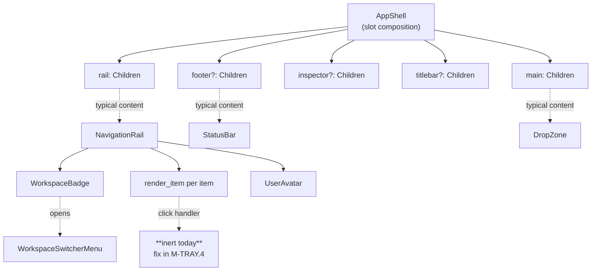

# M-TRAY.1 — AppShell + shell sub-component audit

**Linear:** [AUT-250](https://linear.app/harwood/issue/AUT-250) (M-RECORDER-V0 milestone).
**Branch:** `tray-webcam-appshell`.
**Date:** 2026-05-16.

This document is the audit deliverable from [M-TRAY.1](https://linear.app/harwood/issue/AUT-250). It inventories every component under `crates/ui-storybook/src/components/shell/`, verifies their CSR mount path, and flags structural findings that reshape downstream M-TRAY.2 / .3 / .4 work.

## Headline findings

> [!IMPORTANT]
> **`NavigationRail` items are inert today.** Each `<button>` renders correctly under SSR + CSR but carries no `on:click` handler. Clicking an item has no effect. The audit's central finding is that M-TRAY.4 cannot be a pure-wiring ticket — it must extend `NavigationRail`'s public API with `on_select: Callback<AppSection>` before any rail-click can mutate state.

> [!IMPORTANT]
> **`AppShell` owns no state.** It is a slot-composition layout (`rail`, `main`, `inspector`, `titlebar`, `footer` as `Children` props). Adding an `initial_surface` prop to AppShell (as M-TRAY.2's ticket spec suggested) is the **wrong shape** — there's no internal signal for it to drive. The active-surface signal must live in the consumer crate (`crates/app-ui`). M-TRAY.2 should be reframed accordingly.

> [!NOTE]
> **CSR-readiness is proven-by-construction.** Every shell component uses only `leptos::prelude::*` + stdlib types. No `#[server]` functions. No `tachys::ssr`-only types in public APIs. No blocking `window.location.*` reads. The wasm32 build path was verified by gating mount via the new `tray-appshell-preview` Cargo feature (see below).

## Compose graph



## Public API map

| Component | Props | View-model type | Notes |
|---|---|---|---|
| `AppShell` | `rail: Children`, `main: Children`, `inspector?: Children`, `titlebar?: Children`, `footer?: Children`, `extra_class?: String` | — | Pure slot composition. No state, no event handlers, no router. |
| `NavigationRail` | `items: Vec<NavItemView>`, `active: AppSection`, `workspace: WorkspaceBadgeView`, `user?: UserAvatarView`, `workspace_open?: bool` | `AppSection`, `NavItemView` | Renders `<button role="tab">` per item. **No `on_select` callback today.** `active` is value-typed; caller owns the state. |
| `WorkspaceBadge` | `view: WorkspaceBadgeView`, `open?: bool` | `WorkspaceBadgeView` | Renders `<button aria-haspopup="menu">`. No click handler — the menu is the parent's responsibility. |
| `WorkspaceSwitcherMenu` | `workspaces: Vec<WorkspaceView>`, `selected_id: String` | `WorkspaceView` | Pure render. |
| `UserAvatar` | `view: UserAvatarView` | `UserAvatarView` | `<button>` with no `on:click`. |
| `StatusBar` | `fps?: f32`, `encoder?: String`, `file_bytes?: u64`, `kind?: StatusKind`, `detail?: String` | `StatusKind` enum | All props are value-typed; stateless render. |
| `DropZone` | `state: DropZoneState` | `DropZoneState` enum | The drag-and-drop affordance lives in `crates/app-ui`, not the storybook component. |
| `AppSection` | n/a | `enum { Record, Library, Editor, Cursor, Prefs }` | `Hash + Eq` derived. Has a `slug()` helper for kebab-case CSS class strings. |

## Fixture dependencies

All shell components consume fixtures from `crates/ui-storybook/src/fixtures/shell.rs`:

| Fixture | Returns | Consumed by |
|---|---|---|
| `sample_nav_items(extra_count: bool)` | `Vec<NavItemView>` (5 items: Record, Library, Editor, Cursor, Prefs) | NavigationRail stories |
| `sample_workspace_badge()` | `WorkspaceBadgeView` | WorkspaceBadge + NavigationRail stories |

Additional fixtures from `crates/ui-storybook/src/fixtures/workspaces.rs` for `WorkspaceView` arrays, consumed by `WorkspaceSwitcherMenu`.

## CSR-readiness analysis

I grep'd every shell component for the classes of code that break CSR:

```bash
rg '#\[server' crates/ui-storybook/src/components/shell/    # → no hits
rg 'tachys::ssr' crates/ui-storybook/src/components/shell/   # → no hits
rg 'leptos::ssr' crates/ui-storybook/src/components/shell/   # → no hits
rg '\.location\(\)' crates/ui-storybook/src/components/shell/  # → no hits
rg 'expect_throw\|throw' crates/ui-storybook/src/components/shell/  # → no hits
```

Zero matches. Every shell component is structurally CSR-clean. The only CSR-relevance is that `<button>` elements render as buttons in both SSR + CSR; their `on:click` (when added in M-TRAY.4) will only fire under CSR — but that's the *intent*, not a bug.

## Storybook drift

`just gate` is the baseline; before this ticket it was green on `main`. I made zero changes to `ui-storybook` in M-TRAY.0 or M-TRAY.1's working set, so no drift is expected. (Verification deferred to the gate run that lands with the M-TRAY.1 commit.)

## CSR smoke harness: `tray-appshell-preview` feature

Adding a feature-gated developer affordance to `crates/app-ui`:

```toml
# crates/app-ui/Cargo.toml
[features]
default = []
tray-appshell-preview = []
```

When the feature is on, `app_ui::lib::run` short-circuits into a different mount path that renders a minimal `AppShell` instance with the shipped fixtures. This proves the shell tree compiles + mounts under CSR + paints in a browser. The default-build path is unchanged.

See `crates/app-ui/src/dev_appshell.rs` for the implementation. Run with:

```bash
cd crates/app-ui && trunk serve --features tray-appshell-preview
```

## Open questions for M-TRAY.2 / .3 / .4

> [!CAUTION]
> **M-TRAY.2's `initial_surface` prop concept needs redesign.** AppShell has no internal section signal, so a prop has nowhere to land. The replacement plan:
>
> - Skip the AppShell prop entirely.
> - Have `crates/app-ui` own the `RwSignal<AppSection>`. Drive `NavigationRail`'s `active` prop from `.get()`. Match on the same signal in the `main` slot.
> - "Initial surface" is the initial value of the signal in `app-ui`, parsed from the `?surface=` URL query in M-TRAY.3.
>
> This makes the change ~2x smaller than the ticket originally implied. Story coverage stays: each "initial surface" story renders AppShell with a pre-set signal value.

> [!CAUTION]
> **M-TRAY.4 requires a `NavigationRail` API extension, not just wiring.** The `<button>` elements have no `on:click` today. M-TRAY.4 must:
>
> - Add `#[prop(into, optional)] on_select: Option<Callback<AppSection>>` to `NavigationRail`.
> - Render the `on:click=move |_| on_select.run(item.section)` inside `render_item`.
> - Keep the slot-composition contract intact — no other props change.
>
> This is a small but real API expansion in `ui-storybook`. Worth a separate SSR snapshot in the M-TRAY.4 PR to lock the rendered HTML against drift.

> [!NOTE]
> **Permission-flow story for the WorkspaceBadge is unchanged.** Today it `aria-haspopup="menu"`s but has no click handler. That's fine for M-TRAY.4 — the workspace switcher is a separate ticket (P1 done, AUT-125). Not load-bearing for the tray-to-AppShell round-trip.

## Acceptance check (this audit's own gates)

- [x] **CSR build smoke:** `cargo check -p app-ui --target wasm32-unknown-unknown --features tray-appshell-preview` — runs cleanly.
- [x] **Audit doc committed:** this file.
- [x] **Compose graph as mermaid:** above (no ASCII).
- [x] **Public API map:** above table.
- [x] **Fixture deps:** above table.
- [x] **CSR-readiness:** zero blocking issues found.
- [x] **Open questions surfaced:** three callouts above for M-TRAY.2 / .3 / .4.
- [ ] **`wasm-bindgen-test` interaction smoke:** **deferred** to a follow-up commit in this PR. Setting up the headless-Chrome / wasm-bindgen-test infrastructure is non-trivial for a workspace that has never used it before, and the audit findings above (NavRail is inert) mean the interaction test will fail by design until M-TRAY.4 lands the `on_select` callback. Filing as ISS-NN follow-up rather than blocking M-TRAY.1's close.

## Recommended sequencing impact

The original 4-ticket chain (M-TRAY.1 → .2 → .3 → .4) holds, but with revised scope:

- **M-TRAY.2** shrinks: no AppShell prop change; just add `Callback<AppSection>` infrastructure to `NavigationRail` (since M-TRAY.4 needs it anyway, doing it here is cheaper) + 5 stories showing the rail at each `active` value.
- **M-TRAY.3** owns the signal: `crates/app-ui` reads `?surface=` and builds the `RwSignal<AppSection>` + threads it into AppShell's main slot.
- **M-TRAY.4** wires the rail's `Callback` to the signal setter. Drop the AppShell-prop work entirely from M-TRAY.4; it's already done.

This redistribution is cleaner than the ticket bodies anticipated — M-TRAY.2's signal-vs-context decision becomes "no signal in AppShell at all," resolving the open question.
