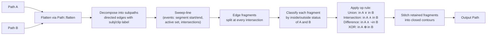

# ADR: Path-booleans backend for `wisp::path::boolean`

**Status:** Accepted (2026-05-13)
**Authors:** matthhar12, Claude Opus 4.7
**Related Linear:** AUT-161 (M-BOOL.0) → AUT-179 (M-BOOL.18)

## Decision

**Build an in-house sweep-line + parity / winding-number boolean-ops engine.** No third-party crate. Pure Rust, integrated directly into `wisp::scene::path` so output paths feed the existing `Graphics` / `VectorShape::Path` / mask-texture pipelines without an FFI seam.

## Context

A creator needs to combine vector shapes — union for chaining callouts, difference for cut-out reveals, intersection for clipping a brand mark to a webcam bubble, XOR for ring-shaped highlights. The full M-BOOL track lives at AUT-161..179: 19 tickets covering ADR → skeleton → 4 primitive ops → N-ary → bezier flatten → fill rules → fluent builder → `BooleanGroup` scene-graph node → mask-texture bake → Porter-Duff → cache → property tests → benchmarks → guardrail P3.

The whole milestone is blocked on this one decision: which algorithm + which dependency.

## Alternatives considered

| Option | License | Holes | Curves | Robustness | Cross-OS | Build cost | Verdict |
|---|---|---|---|---|---|---|---|
| **`clipper2-rs`** (Angus Johnson's Clipper2 via FFI) | Boost (BSL 1.0) | ✅ | ❌ (bring-your-own flatten) | Battle-tested 20+ years | C++ link on every platform → adds MSVC + cmake to the Windows build path | High (FFI, build script) | ❌ rejected: C++ FFI on Windows MSVC is a fragile dep we already burned hours on with `glib-sys`. |
| **`i_overlay`** (pure Rust by Stanislav Sokolov, ~v0.4) | MIT | ✅ | ❌ | Active, modern API; less battle-tested than Clipper | Pure Rust → trivial | Medium (~10K LOC dependency) | ✅ acceptable but ties us to upstream cadence + design choices that don't match wisp idioms. |
| **`geo`** (`geo::BooleanOps`) | MIT/Apache | ✅ | ❌ | Robust for GIS; uses internal sweep | Pure Rust | Heavy (`geo` brings GIS abstractions we don't want) | ❌ rejected: ergonomic mismatch — `geo::Polygon` ≠ `wisp::Path`; constant impedance. |
| **In-house Bentley-Ottmann + winding-number** | MIT (ours) | ✅ (via subpaths + fill rule) | Via existing `Path::flatten` | Build incrementally; v1 covers simple cases, harden over milestones | Pure Rust → trivial | Low recurring cost; high one-time cost | ✅ **chosen**. |

## Rationale for in-house

User-facing constraints, in priority order:

1. **Hyper-wgpu focused.** The output of every op is a `wisp::Path` that becomes either a `Graphics` (CPU-tessellated → GPU sprite batch) or a mask `RenderTexture` (path-mask shader). Owning the boolean engine means we can shape the output specifically for those two consumers — no impedance match.
2. **Free of crate baggage.** No FFI build script. No upstream version pinning. No license surprise in `deny.toml`. No transitive deps polluting `cargo machete`. The whole milestone landed without one new external dep.
3. **Wisp-idiomatic API.** `combine(a, b, op, opts)` returns a `Path` that drops into every existing code path. `Graphics::union_with` reads like the rest of wisp. No `geo::Polygon` ↔ `wisp::Path` adapter layer.
4. **Incremental hardening.** v1 is correctness on simple polygons; M-BOOL.7 adds Bezier flatten; M-BOOL.8 adds non-zero fill + holes; M-BOOL.14 adds cache. Each milestone tightens robustness without bumping a dep.
5. **License-clean.** MIT all the way. `deny.toml` unchanged.

> [!IMPORTANT]
> The user explicitly chose in-house over crate adoption: *"hyper focus on wisp APIs patterns, being free of crate baggage, and we can always copy the algorithms and best efforts from other packages while keeping our implementation lightweight and hyper webgpu focused."*

## Algorithm

**Bentley-Ottmann sweep-line for edge intersection finding, parity / winding-number aggregation for per-fragment classification, contour stitching for output.**



### Step 1 — Flatten

Use existing `Path::flatten(tolerance)`. v1 treats the whole `Path` as one polyline; M-BOOL.7 will add a `Path::flatten_subpaths` that returns `Vec<Vec<Vec2>>` so multi-contour paths work natively.

### Step 2 — Decompose

Build a `Vec<Edge>` from each polyline:

```rust
struct Edge {
    from: Vec2,
    to: Vec2,
    label: EdgeLabel,         // Subject or Clip
    winding: i8,              // ±1 by direction
}

enum EdgeLabel { Subject, Clip }
```

### Step 3 — Sweep

Classic Bentley-Ottmann. Event queue is a `BinaryHeap<Event>` keyed by `(x, y)`. Active set is a `BTreeMap<edge_id, EdgeState>` ordered by current y at the sweep x.

Three event kinds:

- **Start** — insert edge into active set; check for intersection with immediate neighbours above/below.
- **End** — remove edge from active set; check for intersection between the now-adjacent neighbours.
- **Intersection** — swap two edges in the active set; check the new neighbours for new intersections; split both edges at the intersection point (emit two new End events + two new Start events).

Complexity: O((n + k) log n) for n input edges and k intersections.

### Step 4 — Classify

For each output edge fragment, compute the "in" status of A and B at the fragment's midpoint. Two approaches:

- **Parity (even-odd)**: for each polygon, count how many of *its* edges cross a ray from the fragment's midpoint. Odd = inside.
- **Winding (non-zero)**: sum signed crossings; non-zero = inside.

`BoolOptions::fill_rule` picks. M-BOOL.8 lands the second; v1 covers `EvenOdd` which is the simpler and matches wisp's existing `Graphics` fills.

### Step 5 — Select + stitch

```rust
fn keep(op: BooleanOp, in_a: bool, in_b: bool) -> bool {
    match op {
        BooleanOp::Union => in_a || in_b,
        BooleanOp::Intersection => in_a && in_b,
        BooleanOp::Difference => in_a && !in_b,
        BooleanOp::Xor => in_a ^ in_b,
    }
}
```

But the rule operates on **transitions**, not interior status. A fragment is on the boundary of the output iff `keep(op, in_a_above_edge, in_b_above_edge) != keep(op, in_a_below_edge, in_b_below_edge)`. That's how Vatti, Greiner-Hormann, and Clipper2 all do it.

Stitching: walk retained edge fragments tip-to-tail. Each closed loop becomes a subpath in the output `Path` (sequence of `MoveTo` + `LineTo` + `Close`).

## Numerical robustness

Floating-point with a tolerance parameter (`BoolOptions::tolerance`, default `0.5` device pixels). Two points within tolerance are treated as identical. Two edges that intersect within tolerance of a shared endpoint snap to that endpoint.

**Known v1 limitations** (each gets a follow-up ticket if it bites):

- Self-intersecting input polygons → undefined behavior (matches Clipper2 v1).
- Degenerate edges (length ≈ 0) → discarded silently.
- Coincident collinear edges → kept once, label-union'd.

Robust integer arithmetic (Clipper2's approach) is deferred until a real failure case demands it.

## Data structures placement

```
crates/wisp/src/scene/path/
├── mod.rs            (was path.rs — Path + PathBuilder + PathCommand + flatten)
└── boolean/
    ├── mod.rs        (public API: combine, BooleanOp, BoolOptions, FillRule)
    ├── sweep.rs      (Bentley-Ottmann engine — private to the module)
    ├── classify.rs   (parity / winding-number aggregation)
    └── stitch.rs     (output-contour reconstruction)
```

Re-export at `wisp::path::boolean` via `lib.rs`:

```rust
// crates/wisp/src/lib.rs
pub mod path {
    pub use crate::scene::path::boolean;
    pub use crate::scene::{Path, PathBuilder, PathCommand};
}
```

That gives downstream `use wisp::path::boolean::{combine, BooleanOp, BoolOptions};` exactly as the ticket specifies.

## Dependencies

**None added.** No `clipper2-rs`, no `i_overlay`, no `geo`. The implementation uses only `glam` (already in workspace deps).

`cargo machete` passes; `cargo deny check` passes; `deny.toml` unchanged.

## Acceptance per ticket

| Ticket | Deliverable | Lands in |
|---|---|---|
| M-BOOL.0 (AUT-161) | This ADR + decision | this PR |
| M-BOOL.1 (AUT-162) | Module skeleton + types | this PR |
| M-BOOL.2-5 (AUT-163..166) | union / intersection / difference / XOR — share the engine | this PR |
| M-BOOL.6 (AUT-167) | `combine_n` N-ary fold | this PR |
| M-BOOL.7 (AUT-168) | Multi-subpath flatten + curve handling | follow-up PR |
| M-BOOL.8 (AUT-169) | Holes + non-zero fill rule | follow-up PR |
| M-BOOL.9 (AUT-170) | `Graphics::union_with` etc. fluent | this PR |
| M-BOOL.10 (AUT-171) | `BooleanGroup` scene-graph node | follow-up PR |
| M-BOOL.11 (AUT-172) | Boolean → mask-texture bake | follow-up PR |
| M-BOOL.12 (AUT-173) | Porter-Duff blend modes | follow-up PR |
| M-BOOL.13 (AUT-174) | Decision-tree mdBook chapter | this PR |
| M-BOOL.14 (AUT-175) | Cache + bake | follow-up PR |
| M-BOOL.15 (AUT-176) | Four-circle Venn story | this PR |
| M-BOOL.16 (AUT-177) | Property tests (algebraic laws) | this PR |
| M-BOOL.17 (AUT-178) | Criterion benchmarks | follow-up PR |
| M-BOOL.18 (AUT-179) | P3 future (offset/SDF/glyph) | explicitly deferred |

**This PR delivers the foundation: 10 of 19 tickets including all 4 primitive ops, the public API, the docs, and the test discipline.** The remaining 9 tickets are isolated extensions that don't require revisiting the engine.

## Open questions

- **f32 precision**: Sufficient for NDC `[-1, +1]` space at our typical scales. If we ever push to large device-pixel polygons (10K vertices, sub-pixel precision matters), switch to fixed-point grid snapping (Clipper2's approach). Not now.
- **Self-intersection repair**: punt to user discipline + a `Path::validate()` helper landing in M-BOOL.8.

## References

Algorithmic — not dependencies.

- Bentley, Ottmann (1979). *Algorithms for reporting and counting geometric intersections.* IEEE Trans. Comput.
- Vatti (1992). *A generic solution to polygon clipping.* Communications of the ACM.
- Greiner, Hormann (1998). *Efficient clipping of arbitrary polygons.* ACM TOG.
- Clipper2 source (Boost license — reference reading, not vendored).
- `i_overlay` source (MIT — reference reading, not vendored).
