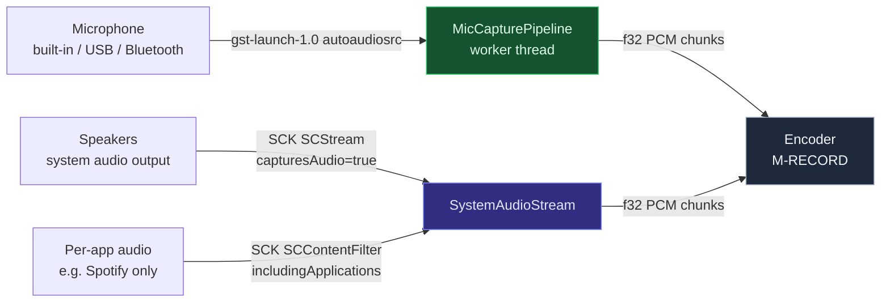
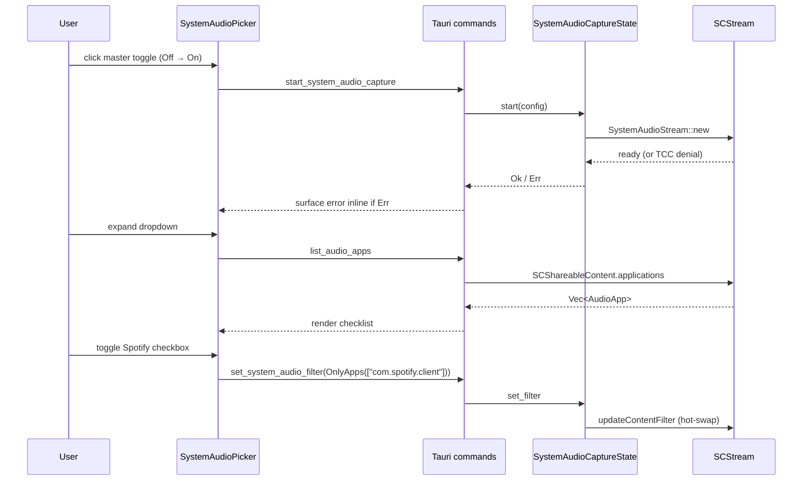

# Audio capture — microphone + system audio (M-AUDIO)

The recorder captures audio from three sources, each going through a different OS path but converging on the same `f32` PCM shape downstream:



```admonish important title="Two backends, one PCM contract"
Microphone capture is gst (cross-platform; uses `autoaudiosrc` under the hood → `osxaudiosrc` on macOS, `pulsesrc` on Linux, `wasapisrc` on Windows). System-audio + per-app capture is ScreenCaptureKit — **macOS-only**, no kernel-extension dependency. Both backends emit Float32LE PCM that `media::audio::AudioChunk` consumes uniformly; the encoder path doesn't know or care which backend the audio came from.
```

## Microphone (M-MIC chain)

The mic chain mirrors the camera chain end-to-end. Three tickets, three layers.

### M-MIC.0 — device enumeration (AUT-277)

`media::list_microphones() -> Vec<MicrophoneDevice>` spawns `gst-device-monitor-1.0 Audio/Source` and parses the text output. Returns `{id, label, is_default, channels, sample_rate_hz}` per attached input.

Two intentional deltas from the camera enumerator:

- **`is_default` uses gst's explicit signal**, not "first in list". On macOS the `properties:` block contains `is-default = true|false`; a Bluetooth headset can be third-listed but flagged default. The first-listed heuristic remains as a fallback for backends that omit the property.
- **`channels` + `sample_rate_hz` come from the first `caps` line** (the device's preferred native format). Either field degrades to `0` ("unknown") when absent; downstream defaults to 48 kHz / 2 channels.
- **ID prefix is `mic-`** so the ID space can't collide with `cam-` at the IPC layer.

```bash
cargo run -p media --example list_microphones
```

### M-MIC.1 — capture worker (AUT-278)

`media::gstreamer_audio::GstreamerAudioCapture::from_microphone(mic_id, format)` spawns:

```
gst-launch-1.0 ! autoaudiosrc ! audioconvert ! audioresample
              ! audio/x-raw,format=F32LE,rate=48000,channels=2
              ! fdsink fd=1
```

`crates/app/src/audio/pipeline.rs::MicCapturePipeline` owns a dedicated thread that pulls 100 ms PCM chunks (4800 frames @ 48 kHz) into Rust. `MicLifecycle { Idle, Starting, Running, Stopping }` (mirror of `PreviewLifecycle`) tracks state; `Drop` cancels + joins, and `GstreamerAudioCapture`'s own `Drop` kills + reaps the gst child.

```admonish note title="Per-device selection deferred"
v0 uses `autoaudiosrc` which always opens the OS default mic. The `mic_id` parameter is plumbed + logged but doesn't yet route to a specific device. Per-mic wiring (`osxaudiosrc device-uid=…` on macOS, `pulsesrc device=…` on Linux) is a drop-in extension to the pipeline-args path — no API change needed.
```

### M-MIC.2 — picker UI (AUT-279)

`<MicPicker />` renders below `<CameraPicker />` in the Recorder surface. Click the trigger → real attached mics enumerate via Tauri IPC; click a row → `start_mic_capture(mic_id)` fires the worker (triggering `NSMicrophoneUsageDescription` prompt on first run); the last-used mic id persists to `LocalStorage` so re-opens land on the same device.

Unlike the camera picker, the mic picker does **not** auto-start the worker on mount. Recording audio without the user clicking would be surprising even for a default mic — opt-in is the cleanest UX.

## System audio (M-AUDIO-SYS chain)

System audio capture (what plays through the speakers — YouTube, Spotify, conference calls) uses ScreenCaptureKit, not gst. There's no general gst element to tap system audio on macOS without a kernel extension (BlackHole, Loopback); SCK is Apple's blessed post-13.0 path.

### M-AUDIO-SYS.0 — SCK system audio (AUT-280)

`media::sck_audio::SystemAudioStream` opens an `SCStream` with `SCStreamConfiguration.capturesAudio = true` against an `SCContentFilter` covering the primary display. An `SCStreamOutput` delegate (defined via `objc2::define_class!`) receives `CMSampleBuffer` audio on SCK's dispatch queue, extracts Float32 PCM from the `AudioBufferList` (handles both interleaved and planar layouts), and forwards onto an `mpsc::Sender`. The caller's `next_chunk(frames)` blocks on the receiver until enough PCM has buffered.

```admonish warning title="macOS 13.0 floor + relaunch quirk"
`SCStreamConfiguration.capturesAudio` is macOS 13.0+ — `Info.plist`'s `LSMinimumSystemVersion` bumped from 12.3 → 13.0 in this ticket. After the user grants Screen Recording in System Settings, **the running app must relaunch** before the new TCC entry takes effect. Well-known macOS quirk; the recorder UX should show a "Quit and reopen" prompt on first grant.
```

`excludesCurrentProcessAudio` defaults to `true` to prevent a feedback loop (the recorder capturing its own output back). Override only for the meta-recording case (recording a tutorial *of using the recorder*).

```bash
cargo run -p media --example system_audio_smoke
```

### M-AUDIO-SYS.1 — per-process filter (AUT-281)

`SystemAudioStream::set_app_filter(AudioAppFilter)` rebuilds the `SCContentFilter` via `updateContentFilter_completionHandler` for hot-swap (no audio gap vs tear-down + recreate).

`AudioAppFilter` variants carry **bundle ids**, not PIDs:

```rust
pub enum AudioAppFilter {
    AllAudio,
    OnlyApps(Vec<String>),     // bundle ids
    ExcludeApps(Vec<String>),  // bundle ids
}
```

PIDs are re-resolved at filter-apply time so a Spotify crash + restart is followed transparently. `list_audio_apps()` enumerates every running app via `SCShareableContent.applications`, deduped by bundle id (Chrome's per-renderer processes collapse to one row).

```bash
cargo run -p media --example list_audio_apps
```

### M-AUDIO-SYS.2 — picker UI (AUT-282)

`<SystemAudioPicker />` renders below `<MicPicker />` in the Recorder surface. Two-button header: a master on/off toggle that starts/stops the SCK session, and an expand button that opens a per-app multi-select dropdown.



Selected bundle ids round-trip through `LocalStorage` (`screen.system_audio.selected_bundle_ids` key), so a Spotify selection survives across launches. Master toggle reverts on start failure with the SCK error surfaced inline (most commonly TCC denial).

```admonish note title="What's deferred from the full ticket spec"
v0 ships the underlying `AudioAppFilter` machinery + a simple multi-select grid. The full spec mentioned filter chips (All / None / Suggested / Custom) and a suggested-app heuristic; those are a presentational layer that lands as M-AUDIO-SYS.2.1. Live per-app audio meters require per-PID RMS computation in the SCK delegate — separate refactor deferred to M-RECORD or a dedicated chunk.
```

## Permissions (M-AUDIO.PERMS / AUT-283)

All three audio paths are gated by TCC entries declared in `crates/app/Info.plist`. **Verified end-to-end** by attempting each path on a freshly-reset TCC state:

| Path | TCC category | Info.plist key |
| --- | --- | --- |
| Microphone | **Microphone** | `NSMicrophoneUsageDescription` |
| System audio | **Screen Recording** | `NSScreenCaptureUsageDescription` |
| Per-process audio | **Screen Recording** (same entry) | `NSScreenCaptureUsageDescription` |

```admonish tip title="One Screen Recording grant covers both SCK audio paths"
The system-audio and per-process-audio paths share a single TCC entry. Once the user grants Screen Recording (either for video capture or for the first system-audio attempt), every subsequent SCK call is silent. **The user sees the prompt once, not twice.**

Verified: `cargo run -p media --example system_audio_smoke` on a freshly-reset TCC returned SCK's *"The user declined TCCs for application, window, display capture"* error — confirming the SCK audio path engages the Screen Recording TCC entry, not Microphone.
```

See [macOS permissions — embedded `Info.plist`](./macos-permissions.md) for the full TCC + bundle-id story.
