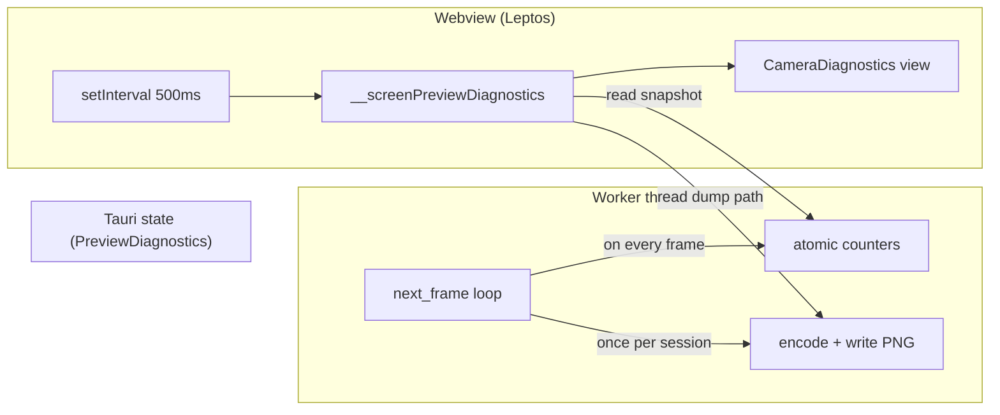
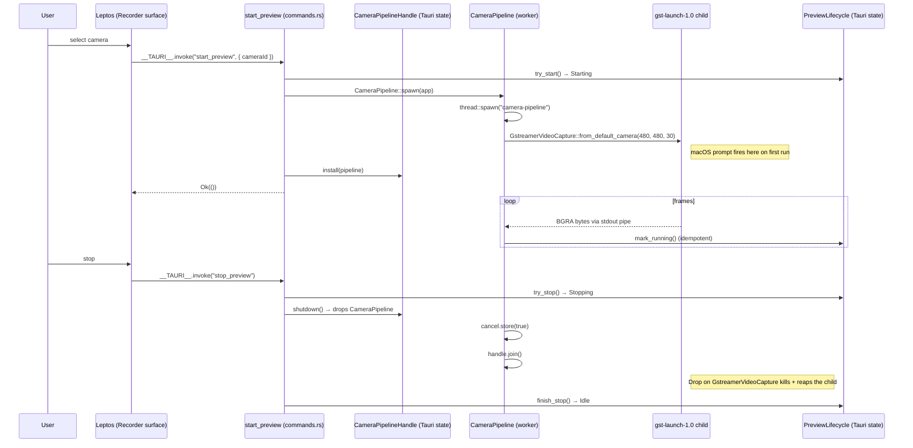

# Camera-pipeline worker — M-CAM.3 (gst layer)

`start_preview` now spawns a real GStreamer subprocess and pulls BGRA frames into Rust. After the macOS permission prompt resolves, the `PreviewLifecycle` state machine transitions `Starting → Running` and stays there until `stop_preview` (which drops the worker, cancels the loop, joins the thread, and kills the gst child via the `Drop` impl on `media::gstreamer_video::GstreamerVideoCapture`).

```admonish important title="What this chunk ships"
**The gst-into-Rust layer + diagnostics overlay.** Real pixels arrive in the worker; the user sees evidence of that via:

1. **`<CameraDiagnostics />` overlay** in the Recorder surface, polling `preview_diagnostics` every 500ms — shows `Source: 480×480 @ 30 fps` + `Frames: 1247` (ticker increments visibly at ~30/sec while the pipeline is alive).
2. **First-frame PNG dump** at `~/Library/Caches/screen-app/first-frame.png` (macOS) / `~/.cache/screen-app/first-frame.png` (Linux) / `%LocalAppData%\screen-app\first-frame.png` (Windows) — one-shot per session. The user can open the file and confirm real pixel data hit Rust.

Three layers still ahead before "your face in a circle in the bubble":

1. **wisp render** — upload each frame to `wisp::VideoTexture`, render a `Stage` with the M-VEC.6 circle mask into an offscreen `RenderTexture`, read back the masked BGRA.
2. **Tauri Channel emit** — push the masked BGRA over `tauri::ipc::Channel<FrameMessage>` to the webview.
3. **Leptos paint** — `putImageData` on the in-AppShell preview canvas (and, after M-BUBBLE.2 lands, the bubble's canvas too via the same broadcast fan-out).

Each layer is its own follow-up commit. This commit is the **proof-of-life** for the gst capture path itself.
```

## Diagnostics architecture



```admonish warning title="Why atomics, not a single Mutex"
The worker pushes 30 frames per second, and the Leptos poll lands ~2 Hz. A shared `Mutex<Stats>` would serialise producer + consumer on the same lock. Atomic `u64` / `u32` reads + writes are wait-free; the consumer just snapshots whatever was last written without blocking the worker. The `first_frame_dump_path` IS behind a `Mutex<Option<PathBuf>>` (one-shot write, rare read), but that's a different concern from the per-frame hot path.
```

## Architecture



## Thread-affinity contract

```admonish warning title="Read this before pulling wisp into the worker"
The worker thread owns the `GstreamerVideoCapture` (a `std::process::Child` + a `BufReader` over its stdout). Both are `Send`, so the spawn is safe. The follow-up commit adds a `wisp::Application` to the worker; wgpu types are `Arc`-backed and `Send`, but they're **thread-affine** once created (CLAUDE.md "wgpu Device + Queue are thread-affine but Send"). The follow-up creates the `Application` inside the worker thread's body, never on the main thread + moved over.
```

## Drop-safety

The `Drop` impl on `CameraPipeline` flips the cancel flag, joins the thread, and triggers `Drop` on the `GstreamerVideoCapture` inside the worker — which kills + reaps the gst-launch child. The chain is:

```
Tauri State<CameraPipelineHandle>::install(new_pipeline)
  → Mutex::lock → Option::replace(Some(new)) → old Option<CameraPipeline> dropped
    → CameraPipeline::drop
      → cancel.store(true)
      → JoinHandle::join (blocks until worker exits)
        → GstreamerVideoCapture::drop inside the worker
          → Child::kill + Child::wait
```

So a re-entrant `start_preview` while a session is already running cleanly tears down the previous session before starting the new one. The smoke test in M-RECP.4 (AUT-265 — no zombie gst processes after app quit) is the regression guard.

## Tests

* **Pure-state**: `CameraPipelineHandle` install / shutdown / is_active round-trip (no thread spawn — that requires a real `tauri::AppHandle` + real gst install + camera).
* **Compile-time invariants**: `PREVIEW_WIDTH == PREVIEW_HEIGHT` (the circle mask the follow-up adds requires square input), `PREVIEW_FPS == 30 || 60` (round targets cameras support natively).

Real end-to-end testing requires hardware. The CI gate runtime-skips when gst-launch isn't on PATH (per the existing `gstreamer_available()` pattern in `crates/decode/tests/gstreamer_integration.rs`).

## Manually verifiable

```admonish tip title="What you see after this chunk"
1. `just test-recorder`
2. Tray → AppShell → Recorder surface.
3. macOS first run: a permission prompt asks for camera access. Grant it.
4. Within ~3 seconds, the small "Camera pipeline" diagnostics overlay updates:
   * `Source:` shows the negotiated dims + fps (e.g. `480×480 @ 30 fps`).
   * `Frames:` starts ticking up visibly at ~30/sec.
   * `First-frame PNG:` shows the absolute path of a PNG file containing your first captured frame. Open it in Finder / your OS file browser — confirms real pixel data reached Rust.
5. Quit the app → no zombie `gst-launch-1.0` processes remain (verify with `ps aux | grep gst-launch`).
6. Reopen → frame counter resets to 0, fresh PNG dump on next first frame.

What you DO NOT yet see: pixels **in the AppShell canvas or the bubble window**. The wisp + Channel + putImageData layers fill that in next. The PNG dump is the developer-facing visual proof; in-app pixels require the next three commits.
```

## Cross-link

* [Webcam bubble overlay](./webcam-bubble.md) — the M-BUBBLE.0/.3/.1 window infrastructure that will host the rendered pixels.
* [Tray → AppShell flow](./tray-to-appshell.md) — the existing surface the camera pipeline mounts under.
