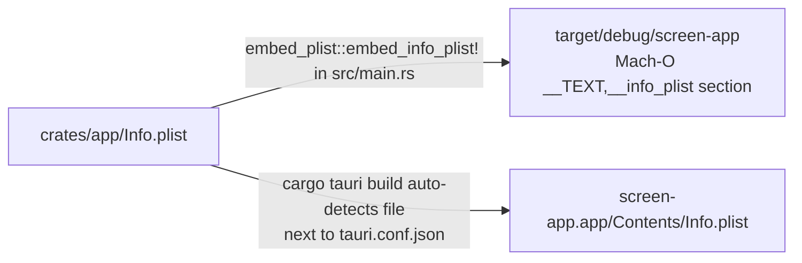

# macOS permissions — embedded `Info.plist`

The recorder needs three macOS TCC (Transparency, Consent and Control) permissions: **Camera**, **Microphone**, and **Screen Recording**. macOS gates these by requiring the requesting app to declare each one in its `Info.plist` via the corresponding `NS*UsageDescription` string. Without the declaration, macOS *silently* returns empty results from APIs like `AVCaptureDevice.devices(for: .video)` — never prompting the user, never showing the app in System Settings → Privacy & Security.

This bites two ways: dev builds and downloaded `.app` bundles.

## Single source of truth

```admonish important
**`crates/app/Info.plist` is the canonical declaration**, read by both the dev binary AND the bundled `.app`. Keeping one file prevents the classic drift where `just test-recorder` works on the dev's machine but the shipped app behaves differently.
```

Two ingestion paths read the same file:



## Dev binary — Mach-O section embed

`cargo run -p screen-app` produces a raw Mach-O at `target/debug/screen-app`. There's no `screen-app.app/Contents/Info.plist` filesystem path for TCC to read. Apple's fallback for command-line tools: a `__TEXT,__info_plist` section embedded in the binary itself (the same mechanism `/usr/bin/screencapture`, `/usr/bin/pmset`, etc. use).

`crates/app/src/main.rs` invokes:

```rust
#[cfg(target_os = "macos")]
embed_plist::embed_info_plist!("../Info.plist");
```

The `embed_plist` macro reads the file at build time, encodes the bytes into a `static [u8; N]` placed via `#[link_section = "__TEXT,__info_plist"]`. TCC reads the section the same way it would read a bundle's `Contents/Info.plist`.

Verify the embed worked:

```bash
otool -s __TEXT __info_plist target/debug/screen-app | head -20
```

You'll see the PLIST DTD declaration in the hex dump — that's the signal.

## Bundled `.app` — Tauri bundler auto-detect

`cargo tauri build` produces `target/release/bundle/macos/screen-app.app`. Tauri's bundler:

1. Reads `crates/app/tauri.conf.json` for the standard keys (`CFBundleIdentifier` ← `identifier`, `CFBundleVersion` ← `version`, etc.).
2. **Looks for `Info.plist` next to `tauri.conf.json`** and merges its keys into the generated bundle plist.
3. Writes the merged result to `screen-app.app/Contents/Info.plist`.

No explicit `bundle.macOS.infoPlist` config field needed — Tauri 2 detects the file by convention.

## What the user actually sees

**First launch** (dev binary OR downloaded `.app`):

1. App tries to enumerate cameras (or open mic, or capture screen).
2. macOS reads the `NS*UsageDescription` string.
3. System prompt appears: *"screen-app would like to access the camera"* followed by our string.
4. User clicks **Allow** or **Don't Allow**.

**Subsequent launches**: silent. The grant is cached under the bundle/binary's TCC entry. The app now appears in **System Settings → Privacy & Security → Camera** (and Microphone, Screen Recording) with a toggle the user can flip later.

## What's in the Info.plist

Twelve keys, four concerns:

### Bundle identity (three keys)

```xml
<key>CFBundleIdentifier</key>      <string>com.screen.app</string>
<key>CFBundleName</key>            <string>screen-app</string>
<key>CFBundleShortVersionString</key> <string>0.1.0</string>
<key>CFBundleVersion</key>         <string>0.1.0</string>
```

`CFBundleIdentifier` is the **TCC key** — macOS pairs the user's permission grant against this string. Once any user has granted Camera (or Mic, or Screen Recording) to `com.screen.app`, that grant survives rebuilds **as long as this string stays the same**. Renaming it = every user is re-prompted. One-way decision. Keep in sync with `identifier` in `tauri.conf.json`.

`CFBundleName` is the **prompt display name** — the macOS dialog says *"`screen-app` would like to access the camera"* using this string.

`CFBundleShortVersionString` + `CFBundleVersion` keep the TCC grant stable across rebuilds on macOS versions that pair the grant with `(id, version)`. Match `version` in `tauri.conf.json`.

### Minimum OS version (one key)

```xml
<key>LSMinimumSystemVersion</key>  <string>12.3</string>
```

ScreenCaptureKit (the API M-SCK uses for display + window + system-audio capture) was introduced in macOS 12.3. Declaring the floor here means macOS gatekeeps launch on older systems instead of letting the user run + silently fail at first screen capture. Camera + Mic capture works on older macOS, but **the recorder isn't useful without screen capture**, so 12.3 is the global floor.

### File-system access strings (four keys)

```xml
<key>NSDocumentsFolderUsageDescription</key>
<string>Screen needs Documents folder access to save and read your screen recordings.</string>

<key>NSDownloadsFolderUsageDescription</key>
<string>Screen needs Downloads folder access to save and read your screen recordings.</string>

<key>NSDesktopFolderUsageDescription</key>
<string>Screen needs Desktop folder access to save and read your screen recordings.</string>

<key>NSRemovableVolumesUsageDescription</key>
<string>Screen needs removable-volume access to save recordings to external drives.</string>
```

Cover the recorder's *programmatic* read/write paths into user-owned folders. **Not needed for explicit file-picker flows** — when the user explicitly chooses a file via an `NSOpenPanel` / `NSSavePanel` (Tauri's file-dialog plugin uses these, and so does drag/drop), macOS treats the selection as an implicit grant and no Info.plist string is required.

```admonish note title="Pickers vs. programmatic — when each kicks in"
| Action | Permission needed |
|---|---|
| User picks "Save…" → chooses `~/Documents/Recording.mp4` | None — picker grants implicit |
| User drags a video file into the recorder | None — drag/drop = implicit pick |
| App auto-writes to `~/Documents/Screen Recordings/` at boot, no picker | `NSDocumentsFolderUsageDescription` triggers prompt |
| App restores a list of previously-recorded files at launch | Same — programmatic enumeration of the user folder |
| App writes to a connected USB drive | `NSRemovableVolumesUsageDescription` |
```

### Permission usage strings (three keys — the load-bearing ones)

```xml
<key>NSCameraUsageDescription</key>
<string>Screen needs camera access to record your webcam alongside your screen.</string>

<key>NSMicrophoneUsageDescription</key>
<string>Screen needs microphone access to record audio with your recordings.</string>

<key>NSScreenCaptureUsageDescription</key>
<string>Screen needs screen recording access to capture your display.</string>
```

These are **user-facing** — they appear verbatim in the macOS prompt. Edit them to explain *why* you need the permission, not what the permission technically grants.

```admonish note title="`NSScreenCaptureUsageDescription` covers more than you'd think"
This one string is the TCC gate for **all** of: full-display capture, specific-window capture, system audio output capture, and per-process audio capture. ScreenCaptureKit's audio capture path uses the screen-recording TCC entry rather than the microphone one — counterintuitive but baked into the framework.

The recorder thus needs only the three strings above to cover every flavour of capture we plan to support.
```

## Platform-quirk reminders

```admonish warning title="Screen Recording requires a relaunch"
`NSScreenCaptureUsageDescription` is the odd one out: granting it does **not** take effect until the app relaunches. This is a well-known macOS behaviour, not a bug. The M-SCK.3 ticket ([AUT-270](https://linear.app/harwood/issue/AUT-270)) handles this with a `PermissionGrantedRequiresRelaunch` UX state.
```

```admonish warning title="Don't rename the bundle identifier post-launch"
TCC tracks permission grants per-bundle-id, not per-file-path. If a future release changes `identifier` in `tauri.conf.json` (currently `com.screen.app`), every user is re-prompted because macOS treats the new identifier as a fresh app. **One-way decision.**
```

```admonish note title="Signed builds for distribution"
For production `.dmg` distribution to users without their seeing Gatekeeper warnings, the bundle must be code-signed with an Apple Developer ID + notarized via Apple's servers. Permission strings still work without signing — but unsigned apps trigger an extra "this app is from an unidentified developer" approval. Acceptable for early-access users; required for App Store / general public.
```

## Resetting permissions during development

If you grant + later want to re-test the first-run prompt path:

```bash
# Reset all camera grants for our bundle id
tccutil reset Camera com.screen.app

# Same for the other two
tccutil reset Microphone com.screen.app
tccutil reset ScreenCapture com.screen.app

# Or reset every TCC entry for our bundle (nuclear)
tccutil reset All com.screen.app
```

Next launch: macOS prompts again.

## Diagnostic: "No cameras detected" silently

If the Recorder surface shows the empty-state "No cameras detected" and you suspect a permission issue, `media::list_cameras` now logs PATH + raw stderr on failure (M-CAM.3 diagnostics commit). Run with verbose logging:

```bash
RUST_LOG=info just test-recorder 2>&1 | grep list_cameras
```

If the log shows `gst-device-monitor exited 0 but parser found 0 cameras`, it's a TCC permission issue — verify the binary has the `__TEXT,__info_plist` section embedded via the `otool` command above.
