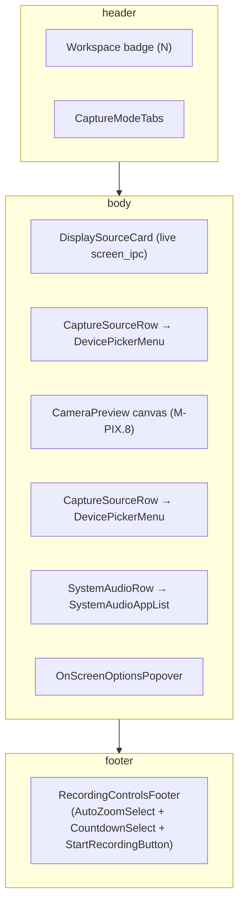

# Recorder Page — live composition of the design components

The Recorder surface is the user's home screen: workspace badge, capture-mode tabs (Screen / Window / Area), source preview with dimensions, camera + mic rows with inline expandable pickers, system-audio multi-select, on-screen options, and the primary record button. `crates/app-ui/src/recorder_page.rs` composes the design from the storybook presentational components into this single surface, owning the live signal state and the IPC wiring.

```admonish important title="Two layers, one render tree"
The **presentational** layer (`ui_storybook::components::recorder::*`) is pure — it takes view-models and renders HTML/CSS. Stories in `ui-storybook` exercise it with compile-time fixtures and snapshot it.

The **live** layer (`crates/app-ui/src/recorder_page.rs`) owns Leptos signals seeded from the `*_ipc` modules and converts each tick of state into the matching view-model. Toggles, selections, and the start-record click handler call back into the IPC modules.

Mixing the two is a contract violation: presentational components can never `invoke()` Tauri commands, and the live layer never reaches into raw HTML — it composes via the presentational components.
```

## Layout



## Signal → view-model conversions

Each presentational component takes a view-model struct. The live page derives that struct from signals on every render:

```mermaid
sequenceDiagram
  autonumber
  participant IPC as camera_ipc / mic_ipc / screen_ipc / system_audio_ipc
  participant Sig as Live signals
  participant VM as view-model fn
  participant Comp as presentational component
  IPC->>Sig: refresh_cameras / refresh_mics / refresh_displays / refresh_audio_apps
  Note over Sig: RwSignal<Vec<…>>, Option<String>, bool, etc.
  Sig->>VM: camera_view() / mic_view() / display_card_view() / system_audio_view()
  VM->>Comp: CaptureSourceView, DeviceOptionView, DisplaySourceView, SystemAudioView
  Comp-->>Sig: (presentational; no callbacks fire from rendering)
```

The `OpenPicker` enum (`None | Camera | Microphone | SystemAudio | OnScreen`) keeps the four expand-states mutually exclusive — opening one closes the others.

## Permissions are untouched

This refactor is **pure render layer**. The TCC flow (camera / microphone / screen-recording prompts), the `request_all_permissions` command, and the `MicLifecycle` / `CameraPermission` state machines all keep their existing public signatures. The `device_state_for(permission, empty)` helper converts the IPC-returned `CameraPermission` into the storybook's `DevicePickerState` so the visual three-state UI (`Populated` / `Empty` / `PermissionNeeded`) renders correctly without the IPC layer knowing about storybook types.

```admonish warning title="Legacy controls panel stays during cutover"
The old `<RecorderControls />` (start button + per-stream LEDs + format dropdown) and the four standalone pickers are kept inside a collapsed `<details>` panel under "Debug · legacy controls" on the Recorder surface. They're behaviour-identical to the live `RecorderPage` but expose extra diagnostics for the cutover. Remove them in a follow-up once the live page has shipped to users.
```

## Tested helpers

`recorder_page.rs` exposes seven pure helpers — all under `#[cfg(test)] mod tests`:

| Helper                          | Purpose                                                     |
|---------------------------------|-------------------------------------------------------------|
| `monogram_for`                  | "FaceTime HD Camera" → "FH" for the device thumbnail glyph  |
| `aspect_ratio_for`              | (3024, 1964) → (756, 491) reduced fraction for CSS          |
| `capture_mode_slug`             | `CaptureMode::Window` → `"window"` for the data-mode attr   |
| `camera_subtitle`               | Picks the right "Built-in · default" / "USB · 1 device" copy|
| `default_on_screen_options`     | Seeds the three CleanDesktop / ShowKeys / BlurSensitive rows|
| `device_state_for`              | Permission + empty → `DevicePickerState`                    |
| `is_suggested_app`              | Bundle-id whitelist for the Suggested filter chip           |

The pure-function split keeps the presentational view-model conversions covered without needing a wasm32 test harness — the same approach the legacy `*_picker.rs` files used for `resolve_default` / `selected_label`.
