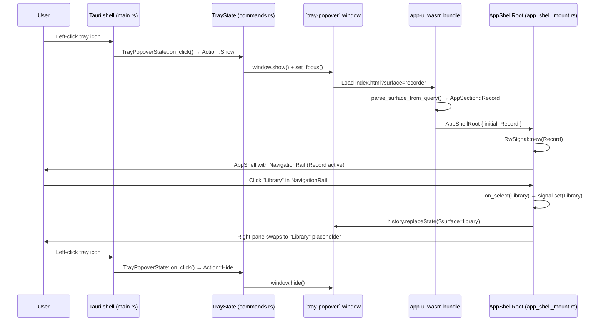

# Tray icon → AppShell → NavigationRail routing — M-TRAY.0..4

`cargo run -p screen-app` puts a small filled-circle icon on the macOS menubar. Left-click toggles the main app window; the window shows the full ui-storybook `AppShell` (with `NavigationRail` on the left) and the `NavigationRail` items switch the right-pane content. Click the tray icon again to hide.

```admonish important
The mask on the tray icon is a macOS **template image** — the OS tints it automatically for light/dark menubar and the active-window highlight. Don't try to ship a coloured icon; you'd lose the auto-tinting.
```

## What ships across the four tickets

| Ticket | Linear | Shippable artifact |
|---|---|---|
| **M-TRAY.0** | [AUT-249](https://linear.app/harwood/issue/AUT-249) | Filled-circle icon registers on the menubar. Click toggles a window. |
| **M-TRAY.1** | [AUT-250](https://linear.app/harwood/issue/AUT-250) | Audit doc + `tray-appshell-preview` Cargo feature proving the shell tree mounts under CSR. |
| **M-TRAY.2** | [AUT-251](https://linear.app/harwood/issue/AUT-251) | `NavigationRail` gains `on_select: Callback<AppSection>` (the API extension M-TRAY.4 needs). |
| **M-TRAY.3** | [AUT-252](https://linear.app/harwood/issue/AUT-252) | Tray window mounts `<AppShellRoot />` with the surface read from `?surface=`. |
| **M-TRAY.4** | [AUT-253](https://linear.app/harwood/issue/AUT-253) | NavigationRail clicks flip the active-surface signal + replace the URL via `history.replaceState`. |

## End-to-end flow



## Architecture decisions

```admonish important title="`AppShell` stays state-free; `app-ui` owns the signal"
The original ticket spec for M-TRAY.2 suggested adding an `initial_surface` prop to `AppShell`. The M-TRAY.1 audit found that `AppShell` is pure slot composition — it has no internal signal for the prop to drive. The active-surface state lives in `crates/app-ui` (specifically in `AppShellRoot`'s `RwSignal<AppSection>`), and it flows into `AppShell`'s `rail` and `main` slots from there. Result: the M-TRAY.2 ticket pivoted from "add prop to AppShell" to "add `on_select: Callback<AppSection>` to NavigationRail" — a smaller, cleaner change.
```

```admonish warning title="`NavigationRail` items were inert until M-TRAY.2"
The buttons in `NavigationRail` rendered correctly under SSR + CSR but carried no `on:click` handler. M-TRAY.2 added an optional `Callback<AppSection>` prop and wired the click. Existing stories that don't pass the callback are unchanged in SSR HTML output — Leptos `on:click` doesn't produce an HTML attribute, only a runtime listener attached during CSR mount.
```

```admonish note title="URL routing as the session-persistence layer"
M-TRAY.4 wires `history.replaceState(?surface=<slug>)` on every NavigationRail click. When the user closes the tray and re-opens it, the WebView reloads `index.html?surface=...` with the last-active surface preserved. Cross-process restart still defaults to `recorder` — true persistence (LocalStorage + `tauri-plugin-store`) is a follow-up in M-RECORDER-V1.
```

## How to verify locally

* `cargo run -p screen-app` — launches the binary. Tray icon appears on the macOS menubar (or Windows tray / Linux app-indicator). Left-click toggles the main window.
* `cargo run -p screen-app --example regen-tray-icons` — regenerates the three `tray.png` raster outputs from the SVG source. Idempotent; commit any changes.
* `just dev-appshell` — runs `trunk serve --features tray-appshell-preview` from `crates/app-ui`, mounting the AppShell directly in a browser at `http://localhost:8080`. NavRail clicks are inert in this mode (M-TRAY.1 dev affordance only — the full routing lives behind `?surface=`).
* `cargo test -p app-ui --lib` — runs the 7 routing round-trip tests in `crates/app-ui/src/routing.rs`.
* `cargo nextest run -p screen-app --lib` — runs the 4 `TrayPopoverState` state-machine tests.

## What this closes vs what's deferred

**Closes:** the M-TRAY.0..4 sequence end-to-end. Tray → AppShell → NavRail surface switching all work on macOS; cross-OS compile paths are gate-green.

**Deferred to M-RECORDER-V1:**

* Cross-process surface persistence (LocalStorage / `tauri-plugin-store`).
* Multi-display window positioning under the tray click (M-RECP.1).
* The small `TrayRecordPopover` quick-record window as a *separate* surface — `tray-popover` today opens the full AppShell, not the AUT-132 small popover. Worth filing as a separate "tray quick-record popover" track post-V0.
* `wasm-bindgen-test` interaction smoke for NavigationRail click → signal-change. Skipped pending the headless-browser CI setup.
