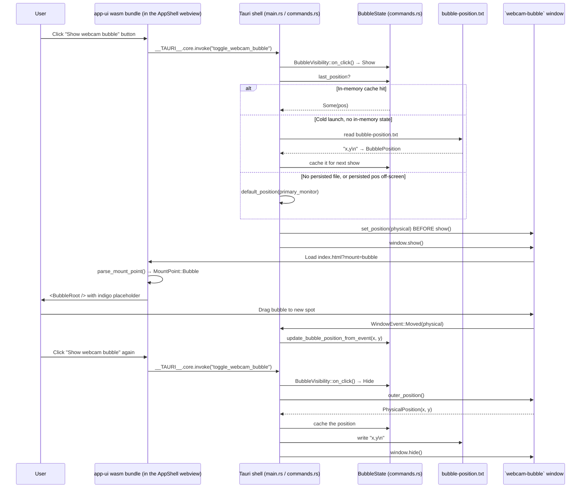

# Webcam-bubble overlay — M-BUBBLE.0 + .3

`cargo run -p screen-app --features custom-protocol` (or `just test-recorder`) puts a "Show webcam bubble" toggle in the Recorder surface of the AppShell. Clicking it reveals a borderless, transparent, always-on-top `200×200` Tauri window — the future home of the recognisable Screen-Studio-style floating webcam circle. For v0 the bubble shows an indigo "Webcam" placeholder; the live wisp-rendered canvas inside it is **M-BUBBLE.2**, which is blocked on the M-CAM.3 pipeline (see "Blockers downstream" below).

The bubble's position is **persisted across hide / show cycles AND across app launches** — drag the bubble anywhere on screen, hide it, reopen it: it reappears at the spot you left it. After a display unplug (so the saved position lands off-screen) the bubble falls back to a sensible default (bottom-right of the primary monitor, 16 px inset).

```admonish important
The bubble window is **a third Tauri window**, alongside `main` (the legacy drop-zone shell, kept hidden) and `tray-popover` (the AppShell-hosting window). All three are declared in `crates/app/tauri.conf.json`. URL routing (`?surface=…` vs `?mount=…`) controls which Leptos tree the shared `app-ui` bundle mounts in each window — the bundle is one wasm artifact serving three webviews.
```

## What ships across the two tickets

| Ticket | Linear | Shippable artifact |
|---|---|---|
| **M-BUBBLE.0** | [AUT-273](https://linear.app/harwood/issue/AUT-273) | `webcam-bubble` Tauri window registered; `BubbleVisibility` state machine; `toggle_webcam_bubble` Tauri command; "Show webcam bubble" button in the Recorder surface; new `MountPoint` enum dispatching `?mount=bubble` to `<BubbleRoot />`. |
| **M-BUBBLE.3** | [AUT-276](https://linear.app/harwood/issue/AUT-276) | `BubblePosition` persisted to `<app-config-dir>/bubble-position.txt` on hide, restored on show. `WindowEvent::Moved` listener keeps the in-memory cache fresh during a drag. `snap_to_nearest_corner` pure-Rust helper tested end-to-end (wiring to the drag event deferred — see "Why snap-on-drag is inert"). |

## End-to-end flow



## Coordinate-system contract

```admonish warning
All bubble position math runs in **physical pixels**, not logical pixels. `MonitorBounds` (defined alongside the tray-positioning helpers) is physical. `WebviewWindow::outer_position()` returns physical. The `set_position` call uses `PhysicalPosition::new(i32, i32)` to stay consistent. A future regression where someone mixes a `LogicalPosition` into the bubble path will show up on Retina displays as a 2× offset on first show — the existing tests catch the math but not the unit mismatch, so reviewers should grep for `LogicalPosition` in any future bubble-position patch.
```

## Persistence file format

```admonish note
`bubble-position.txt` is two ASCII integers + a comma + a newline:

\`\`\`text
1704,864
\`\`\`

Deliberately not JSON / TOML / Bincode — the format is two integers; a hand-rolled parser is six lines of code, has tests for malformed inputs, and saves a dependency on `serde_json` in the screen-app crate. If a third field ever lands (the snap-corner identity, say, or a "bubble shape" enum), bump the format with a leading version byte and keep the parser one function.
```

## Why snap-on-drag is inert in v0

The pure-Rust `snap_to_nearest_corner` helper is fully implemented + tested in `crates/app/src/recp/bubble_position.rs` — given a current position + monitor bounds + a snap radius, it returns the snapped position OR `None` if the bubble is far from every corner.

It's **not wired** to `WindowEvent::Moved` yet. The reason: calling `window.set_position(snapped)` from inside the `Moved` handler triggers another `Moved` event for the new position. Without a "last-snap-applied-was" guard or a leading-edge debounce, that's an infinite event loop that pegs the OS event queue.

Wiring it cleanly requires either:

1. A small `last_snap_applied: AtomicI32 × 2` to short-circuit re-snapping to the same coords, OR
2. A trailing debounce (250 ms via `tokio::time::sleep`) that fires snap only after the drag stops, OR
3. A separate `WindowEvent::MouseUp` / `DragEnd` signal Tauri 2 doesn't expose today on all OSes.

Option 1 is the obvious choice for a follow-up; the math is the load-bearing piece and it's tested. Filed as a v1 polish ticket alongside the resize-handle work that's also deferred from AUT-276.

## Tests

* **`BubbleVisibility` state machine** (4 tests) — round-trips, default-state, ten-alternating-clicks parity check.
* **`MountPoint` parsing** (4 tests) — `?surface=…` wins over `?mount=…`, unknown queries fall through to `DropZone`, `?mount=bubble` lands in the new `Bubble` mount.
* **`default_position`** — bottom-right of monitor with inset; respects secondary-monitor offsets.
* **`is_on_any_monitor`** — true for fully-inside, true for partial overlap, false for fully-off-screen and for positions that assumed a now-gone secondary display.
* **`snap_to_nearest_corner`** — snaps to bottom-right when near, snaps to top-left when near, chooses nearest corner when two are in range, returns `None` for dead-center, respects monitor offsets.
* **`BubbleState` + persistence helpers** — `encode_position` / `decode_position` round-trip; rejects malformed inputs (missing comma, non-integer, empty); tolerates whitespace + missing trailing newline; `update_bubble_position_from_event` updates the in-memory cache atomically.

Total: 26+ unit tests covering the M-BUBBLE.0 + .3 surface.

## Manually verifiable

```admonish tip title="Single-command verification"
\`\`\`bash
just test-recorder
\`\`\`

1. Click the menubar tray circle → AppShell window opens.
2. Recorder surface → click **"Show webcam bubble"**.
3. A 200×200 borderless transparent window appears bottom-right of your primary display.
4. Drag it to a new spot.
5. Click **"Show webcam bubble"** again → hides.
6. Click **"Show webcam bubble"** again → reappears at the dragged spot.
7. Quit the app, relaunch (`just test-recorder` again), click through to show the bubble → it reappears at the same spot from the previous session.
```

## Blockers downstream

```admonish bug title="M-BUBBLE.2 needs M-CAM.3 to actually flow frames"
`crates/app-ui/src/camera_preview.rs` lines 9–18 note that M-CAM.3's wisp pipeline (gst → wisp::Stage with M-VEC.6 circle mask → offscreen RT → BGRA readback → Tauri Channel emit) is **scaffolding-only** in current `main`. Until that pipeline ships, the bubble's canvas (M-BUBBLE.2 / AUT-275) has nothing to subscribe to. The bubble window infrastructure (this chapter) is fully landed; the wisp-rendered pixels inside are a separate effort tracked on a separate branch.
```

## Cross-link

* [Tauri tray → AppShell flow](./tray-to-appshell.md) — the existing tray-popover machinery this work parallels (same state-machine shape, same URL-routed mount pattern).
