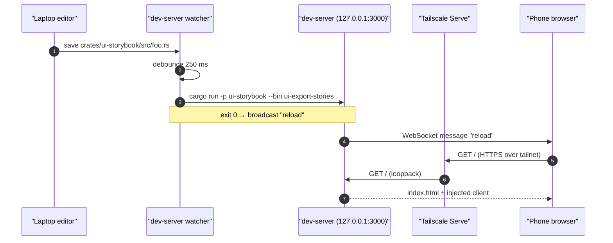

# Remote dev — phone preview over Tailscale

[Linear: AUT-153](https://linear.app/harwood/issue/AUT-153) (the
≤5-click ticket).

The goal: edit UI on the laptop, see the change on a phone over
the open internet, without exposing a public URL. `just dev-remote`
wraps [`just dev`](./dev-loop.md) and pipes it through
[Tailscale Serve](https://tailscale.com/kb/1242/tailscale-serve)
so the loop reaches whatever device is signed into your tailnet.

## One-time setup (5 clicks)

1. **Laptop: install Tailscale.**

   - macOS: `brew install --cask tailscale` (the cask installs the
     system-extension build that supports `tailscale serve`; the
     Mac App Store build does too but takes a couple of trust-prompts).
   - Linux: `curl -fsSL https://tailscale.com/install.sh | sh`.

2. **Laptop: sign in.** Run `tailscale up`. A browser opens to a
   Tailscale OAuth flow (Google / GitHub / Microsoft / email).
   One click in the browser.

3. **Phone: install Tailscale** from the App Store / Play Store.
   Open it, tap your account provider, authenticate.

4. **Phone: sign in to the *same* account** as the laptop. The
   tailnet sees both devices.

5. **Run + tap.** On the laptop: `just dev-remote`. It prints a URL
   like `https://laptop-name.tailnet-id.ts.net`. On the phone, paste
   or tap that URL.

That's the five clicks. Optional sixth (recommended once): on the
phone, Safari → Share → **Add to Home Screen** (or Chrome →
three-dot menu → **Add to Home screen**). The URL becomes a
launchable icon — daily flow afterwards is two interactions:
`just dev-remote` on laptop, tap home-screen icon on phone.

## Daily flow

```bash
just dev-remote
```

Wait ~5 seconds for the dev-server to boot and Tailscale Serve to
finish provisioning. Tap the home-screen icon on the phone.

When you're done:

```bash
just dev-remote-stop
```

This tears down Tailscale Serve and kills the background
`dev-server` process. Idempotent — safe to run even if nothing is
running.

## Verify the tailnet (one-time)

If `just dev-remote` prints a URL but the phone can't reach it:

```bash
tailscale status              # phone's name should appear
tailscale ping <phone-name>   # should report round-trip times
```

If `tailscale ping` fails, check the Tailscale admin console:

- DNS → **MagicDNS** is enabled.
- ACLs default policy allows the phone → laptop.

## Privacy

`tailscale serve` is **private** to your tailnet. Only devices
signed into the same Tailscale account can reach the URL. Stop the
exposure with `just dev-remote-stop` (or `tailscale serve --https=443 off`).

```admonish warning title="Tailscale Serve, not Tailscale Funnel"
`tailscale funnel` is the *public* sibling — it exposes the same
URL to the open internet. `just dev-remote` deliberately uses
`tailscale serve` instead. Do not flip to `funnel` for this loop.
```

## Troubleshooting

- **`tailscale serve` permission denied.** macOS may prompt to
  authorise the system extension once after `brew install --cask`;
  approve it in System Settings → Privacy & Security.
- **HTTPS cert says "issuing" for a minute.** Tailscale provisions
  a real Let's Encrypt cert on first Serve. Re-run
  `tailscale serve status` in 30–60 s.
- **Phone reloads but content is stale.** Force-refresh
  (long-press the reload button in Safari, or pull-to-refresh in
  Chrome). The live-reload script reconnects after a server
  restart, but a cold cache may need a manual nudge.
- **iOS Home Screen icon looks wrong.** Add a `<link rel="apple-touch-icon">`
  to the index page later; not blocking.

## Composition



## The books (mdBook live-reload)

The same Tailscale machinery serves the two mdBooks, with `mdbook
serve` providing the live-reload (no `dev-server` involved — mdbook
has built-in filesystem watch + websocket reload).

Two books, two ports so you can run both at once:

```bash
# Terminal 1 — screen project book
just dev-book          # http://127.0.0.1:3001/

# Terminal 2 — wisp library book
just dev-wisp-book     # http://127.0.0.1:3002/

# Terminal 3 (once) — expose both over Tailscale
just dev-remote-book
```

`dev-remote-book` registers two Tailscale Serve path proxies:

| Phone URL                                          | Routes to                  |
|----------------------------------------------------|----------------------------|
| `https://<MAC>.<TAILNET>.ts.net/`                  | `http://127.0.0.1:3001/`   |
| `https://<MAC>.<TAILNET>.ts.net/wisp/`             | `http://127.0.0.1:3002/`   |

Both books pass through `mdbook-preprocessor-cross` on every
rebuild, so `\{\{shared X\}\}` and `\{\{wisp-link Y\}\}` tags get
re-resolved live as you edit. The cross-book links work because
the production base path (`/screen/wisp/`) doesn't match the
local path (`/wisp/`) — but mdbook's `site-url` is configured for
production, so on local you'll see the cross-links pointing at
`/screen/wisp/...` which won't resolve. **For local cross-book
nav, use the book's own TOC**; for production-shape verification,
deploy preview or `just site` + open `target/book/`.

Stop with `just dev-remote-book-stop` (tears down the Tailscale
routes; leave `mdbook serve` running in their terminals and Ctrl-C
when you're done).

```admonish note title="What 'live reload' covers"
mdbook serve rebuilds + reloads on changes under the book's
`src/` tree AND `book.toml`. Changes to `_docs/shared/` files
also trigger a rebuild — both books' `src/` tree includes a
`{{shared}}` tag that pulls in those files, and mdbook's watch
covers them transitively. Changes to the **preprocessor source**
(`tools/mdbook-preprocessor-cross/src/lib.rs`) do NOT — you have
to Ctrl-C and re-run `just dev-book` so `preprocessor-build`
recompiles.
```
