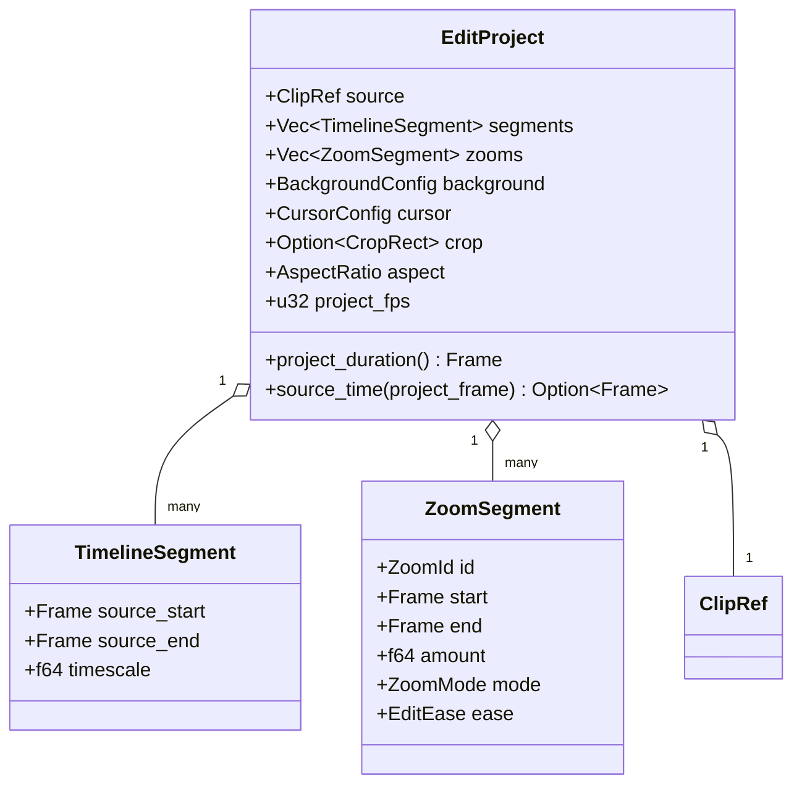
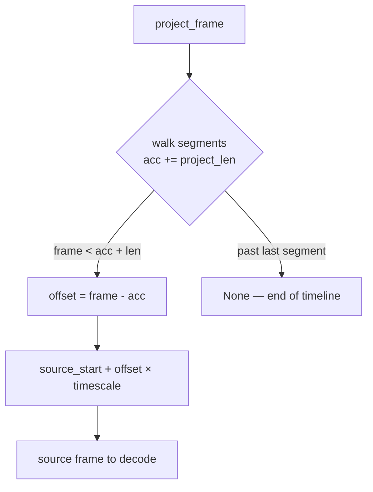

# The edit model — ED.1

`crates/edit` is the editor's spine: a pure, serializable model of an
edit with **no GPU, media, or UI dependencies** — just data and the
arithmetic that maps timeline time to source-clip time. Everything the
editor does (trim, split, speed, crop, zoom, undo/redo, export) is an
operation on, or a render of, this model. Keeping it dependency-light is
what makes it exhaustively unit-testable on any machine.

## The shape



The edited video is the **ordered concatenation of the segments**.
Trimming adjusts a segment's `source_start` / `source_end`; splitting
replaces one segment with two adjacent ones sharing the cut frame;
changing speed sets a segment's `timescale`. Zoom regions, the framing
config, and the crop ride alongside — the renderer applies them per
frame.

## Project time → source time

Project time is frame-indexed at `project_fps` (default 30). The core of
the model is `source_time(project_frame)`: walk the segment list,
accumulating each segment's **project length**, until you find the one
containing the frame, then map the within-segment offset to a **source**
frame using that segment's `timescale`.



A `timescale` of `2.0` means 2× speed: a 100-source-frame slice occupies
only 50 project frames, and project offset `p` maps to source frame
`2p`. Worked example for a three-segment project:

| segment | source frames | timescale | project frames |
| ------- | ------------- | --------- | -------------- |
| 0       | `[0, 300)`    | `1.0`     | `0..300`       |
| 1       | `[300, 600)`  | `2.0`     | `300..450`     |
| 2       | `[600, 900)`  | `1.0`     | `450..750`     |

So `source_time(375)` lands in segment 1 at offset 75 → source frame
`300 + 75×2 = 450`, and the whole timeline is 750 project frames long.

```admonish note title="timescale is sanitized, sped-up clips never vanish"
A non-finite or non-positive `timescale` falls back to real time, so the
mapping can never divide by zero or produce `NaN`. A non-empty slice
always occupies **at least one** project frame, so even a 100× speed-up
of a single frame stays visible.
```

See the [`edit` rustdoc](../../api/edit/index.html) for the full API —
[`EditProject`](../../api/edit/project/struct.EditProject.html),
[`TimelineSegment`](../../api/edit/segment/struct.TimelineSegment.html), and
[`ZoomSegment`](../../api/edit/zoom/struct.ZoomSegment.html).
