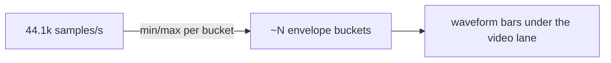

# Audio waveform lane — ED.10

For decades the picture editor cut blind to sound, then threaded a separate
**magnetic track** onto the flatbed's soundhead so picture and audio ran in
sync — and you cut on what you could *hear*. The waveform is that mag track
made visible: you find the breath before a sentence, the click of a button,
the silence to trim, all by eye. You cannot splice on a sound you cannot
see.

[`downsample_peaks`](../../api/app_ui/waveform/fn.downsample_peaks.html)
turns a sea of samples into one **min/max pair per horizontal bucket** —
the peak envelope. Drawing every sample is both impossible (millions of
them) and pointless (the screen has a few hundred pixels); the envelope is
exactly what the eye reads. The [`AudioWaveform`](../../api/app_ui/waveform/fn.AudioWaveform.html)
lane draws those buckets beneath the video track, aligned to the same
timeline.



```admonish note title="Decode lands with render integration"
The envelope math is pure and tested here. Decoding the recording's audio
track into samples is GStreamer work that joins the render-integration pass
(alongside the native preview window and clip thumbnails); until then the
lane draws a quiet baseline. The contract — samples in, peak envelope out —
is already nailed down, so lighting the lane up is just feeding it.
```
