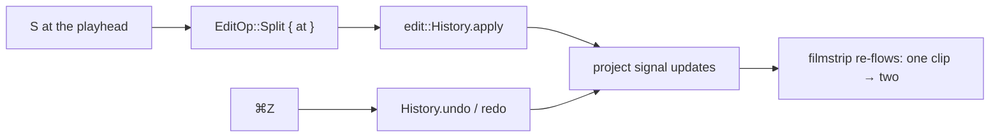

# Splitting + undo/redo — ED.11

The most physical act in the cutting room: lay the film on the bench, drop
the razor on the frame line, and you have two pieces where there was one.
And its safety net — the **trim bin**, where every offcut hangs so no cut
is ever final. ED.11 brings both to the timeline: **`S`** splits the clip
under the playhead; **`⌘Z` / `⌘⇧Z`** walk the trim bin.



The cut itself is just an `EditOp` against the (proptest-verified)
[`History`](../../api/edit/history/struct.History.html) from ED.2 — the UI
layer is thin: [`resolve_history`](../../api/app_ui/editor_edits/fn.resolve_history.html)
reuses the running history when it belongs to the open clip (so the undo
stack survives) or starts fresh when a different clip loads, then the edit
runs and the result syncs into the reactive project signal the
[filmstrip](./ed9-filmstrip.md) already renders. Splitting is
**non-destructive** — it divides a segment's range, never the negative.

```admonish note title="Why split is free, and what comes next"
A split is duration-preserving — two segments where there was one, same
total length — so the playhead clock needs no update. Duration-*changing*
edits (ripple-delete, edge-trim) land next and use the new
`EditorPlayer::set_duration` (already written + tested here) to keep the
clock's range in step after the timeline shrinks or grows. The toolbar's
Split button becomes live once the shell component takes action callbacks;
for now the razor is the `S` key.
```
