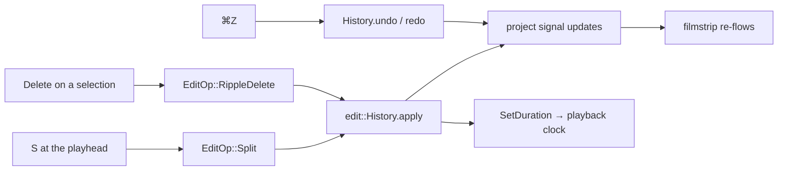

# Splitting, ripple-delete + undo/redo — ED.11

The most physical act in the cutting room: lay the film on the bench, drop
the razor on the frame line, and you have two pieces where there was one.
Lift one piece out and push the ends together and the cut closes — a
**ripple**. And behind both, the safety net: the **trim bin**, where every
offcut hangs so nothing is ever final. ED.11 brings all three to the
timeline — **`S`** splits the clip under the playhead, **`Delete`** lifts the
selected clip and closes the gap, **`⌘Z` / `⌘⇧Z`** walk the trim bin.



Each edit is just an `EditOp` against the (proptest-verified)
[`History`](../../api/edit/history/struct.History.html) from ED.2 — the UI
layer is thin. [`resolve_history`](../../api/app_ui/editor_edits/fn.resolve_history.html)
reuses the running history when it belongs to the open clip (so the undo
stack survives) or starts fresh when a different clip loads;
[`segment_project_range`](../../api/app_ui/editor_edits/fn.segment_project_range.html)
turns the selected clip index into the `[start, end)` frames a ripple
deletes. The result syncs into the reactive project signal the
[filmstrip](./ed9-filmstrip.md) already renders. Nothing here touches the
negative — a split divides a segment's range, a ripple drops a segment from
the list.

```admonish note title="Split is free; ripple pays the clock"
A split is duration-preserving — same total length — so the playhead clock
is untouched. A **ripple delete shortens the timeline**, so every edit ends
by syncing the new length to the playback clock through
`EditorPlayer::set_duration` (a no-op for split, the whole point of it for
ripple and for undoing a ripple). What's left for the next pass is the
*gesture* layer — dragging a clip's edge to trim, and magnetic snapping to
cut points — plus making the toolbar's Split button live. The keyboard
razor (`S`), ripple (`Delete`), and trim bin (`⌘Z` / `⌘⇧Z`) work today.
```
