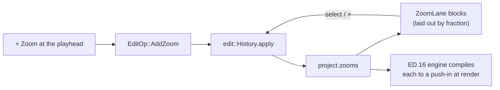

# The zoom lane — ED.12

The rostrum operator never improvised a push-in. Every camera move was
planned on an **exposure sheet** — ruled paper where each row was a frame
and a margin column noted the moves: *zoom in, frames 120–180; hold; zoom
out*. The move list was authored on paper, then executed by the stand. ED.12
is that exposure sheet as a timeline lane: each block is one planned
push-in, and the [zoom engine](./ed16-zoom-engine.md) is the stand that
executes it at preview and export.



The lane authors `ZoomSegment` values; it never renders pixels. A block is
laid out by [`zoom_spans`](../../api/app_ui/zoom_lane/fn.zoom_spans.html) with
the *same* fraction-of-duration math as the [filmstrip](./ed9-filmstrip.md),
so the zoom lane lines up frame-for-frame with the video and audio tracks
above and below it. **+ Zoom** drops a default ~1.5 s, 1.6× region at the
playhead through `EditOp::AddZoom`; clicking a block selects it; its **×**
removes it — all via the proptest-verified `History`, so every add and
remove is undoable from the [trim bin](./ed11-editing.md).

```admonish important title="Authoring is separate from rendering"
The lane and the engine are deliberately split. The lane (`app-ui`,
reactive Leptos) only mutates the project's zoom list; the engine (`edit`,
pure arithmetic) turns that list into a transform per frame. Neither knows
about the other's medium — which is why the zoom model is unit-testable
without a GPU and the lane is testable without a renderer. Drag a block's
body to move it, or its edges to retime, in the deferred gesture pass
(alongside clip-edge trim); for now the authoring verbs are add, select,
and remove.
```
