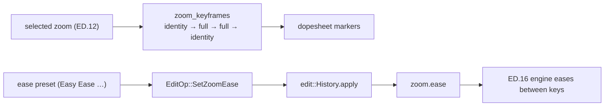

# Dopesheet keyframes + Easy Ease — ED.13

The animator's **dope sheet** was a frame-by-frame timing chart: which
drawing on which frame, how a move accelerates and settles. A zoom is the
same idea — a value (scale) keyframed across time and *eased* between the
keys. ED.13 brings that chart to the selected zoom:
[`ZoomDopesheet`](../../api/app_ui/zoom_dopesheet/fn.ZoomDopesheet.html) plots
its keyframes and offers the easing presets, with **Easy Ease** front and
centre.



[`zoom_keyframes`](../../api/edit/zoom_anim/fn.zoom_keyframes.html) is the
pure, `Track`-shaped view of the [engine's](./ed16-zoom-engine.md) ramp:
identity at both edges, full `amount` across the hold (a triangle when the
ramps fill the window), the same `ramp_frames` the engine uses — so the
dopesheet shows exactly what plays. The ease row commits `EditOp::SetZoomEase`
through the shared `History` (undoable), and the engine eases between the
keys with the chosen curve. The default and one-click favourite is **Easy
Ease** (`InOutCubic`) — accelerate off the wide shot, settle into the detail.

```admonish note title="Keyframe model now; the curve renders via ED.16"
The dopesheet authors the *timing* — the keyframe positions and the ease —
and reads from the same `zoom_keyframes`/`zoom_at` math the engine renders,
so it can't drift from playback. Plotting an editable Bézier curve handle
(drag the ease) and compiling to a literal `wisp_animation::Track<Transform>`
(its `Ease` set maps 1:1 to ours) are refinements that ride the
render-integration pass; the keyframe model + ease selection are the
authoring core, and `EditEase::eval` already drives the eased motion today.
```
