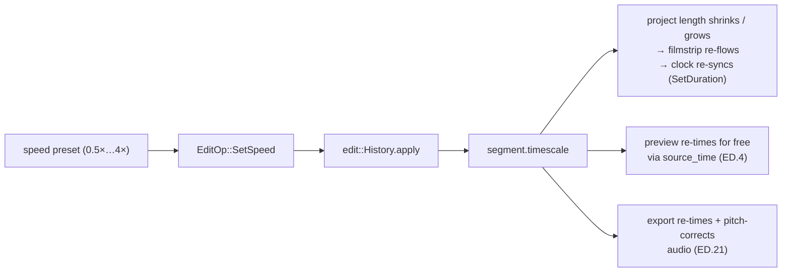

# Per-segment speed — ED.14

Speed was a lab trick long before it was a slider. On the optical printer,
**step-printing** exposed each negative frame two or three times to make
slow motion; **skip-printing** dropped frames for fast motion. The Steenbeck
let an editor crank faster or slower to *find* the moment, but the speed
that shipped was baked into the print at the lab. ED.14 makes it a value
instead: a `timescale` on a segment, re-derived at preview and export so
nothing is baked until you ask for it.



Each [`TimelineSegment`](../../api/edit/segment/struct.TimelineSegment.html)
carries a `timescale`: a 2× segment occupies *half* its source span in
project time, a 0.5× segment twice as much. The
[`ClipInspector`](../../api/app_ui/clip_inspector/fn.ClipInspector.html)
shows presets for the selected clip; choosing one runs `EditOp::SetSpeed`
through the shared `History` (undoable from the trim bin). Because speed is
**duration-changing**, the edit re-flows the filmstrip and re-syncs the
playback clock — the same `SetDuration` path a ripple uses.

```admonish important title="Preview is free; audio retiming is export's job"
The preview re-times with *no new code*: the variable-rate clock (ED.4)
maps a project frame to a source frame through the segment's `timescale`
(`source_time`), so a sped-up clip simply decodes its source frames faster.
What ED.14 adds on the editor side is purely the authoring control. The
source recording is a single muxed mp4, so **audio resampling + pitch
correction happen in the export pass** (ED.21) via a second `GStreamer`
leg per segment — there's no raw audio scratch to retime at edit time.
```
