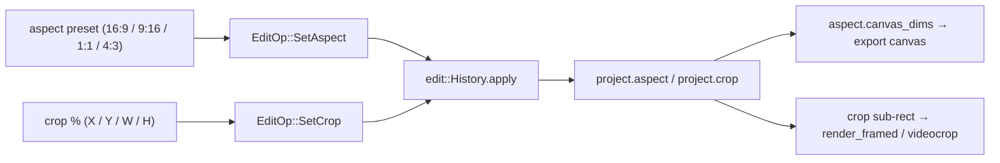

# Crop + aspect reframe — ED.15

Aspect ratio used to be a piece of metal. A **hard matte** in the camera or
optical printer blacked the frame down to 16:9, or 4:3, or anamorphic 2.35
— the shape was *masked into* the negative. Releasing a 4:3 negative to a
16:9 screen meant **pan-and-scan**: an operator chose, frame by frame,
which window of the image to keep. ED.15 makes both into values — the
matte (`aspect`) and the chosen window (`crop`) — stored on the project and
re-derived at export, so the same source reframes to a widescreen export or
a vertical short without ever recutting it.



The [`FramingInspector`](../../api/app_ui/framing_inspector/fn.FramingInspector.html)
carries both: aspect-ratio presets (the matte) and four numeric crop fields
as percentages (the window), with a reset to full frame. Each runs
`EditOp::SetAspect` / `EditOp::SetCrop` through the shared `History`, so
reframing is undoable. `SetCrop` **sanitizes** the rect to a valid in-frame
sub-rect (non-zero extent, inside `[0, 1]`), and a full-frame crop is stored
as *no crop* so the export can skip the `videocrop` element entirely.

```admonish important title="Authoring now; the visible reframe at render"
ED.15 ships the authoring side — the ops + the inspector. The aspect ratio
becomes the export canvas via `AspectRatio::canvas_dims` (already used by
the export plan), and the crop becomes a sub-rect of the screen sprite. The
*visible* reframe — preview reshaping live and the export honoring the crop
— lands with the render-integration / export pass (ED.20 / ED.21), whose
`render_framed` composes crop-then-zoom into the screen sprite's transform.
The 25/50/75 % rule-of-thirds grid guides are a preview overlay that lands
with that same pass.
```
