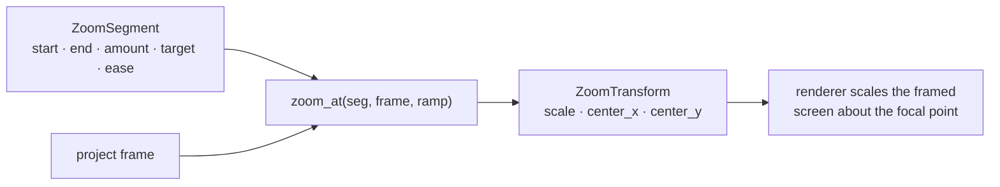

# The zoom engine — ED.16

On an animation stand the camera lived on a column above the artwork, and
the operator pushed in by turning a screw drive — a slow, deliberate move
from wide to tight, hold on the detail, then ease back out. That move, the
**rostrum push-in**, is the single gesture that reads as "cinematic" in a
screen recording: the viewer's eye is walked to exactly the thing that
matters. ED.16 is that move in software — and, crucially, it is *pure
arithmetic*, so the same function drives the live preview and the final
export. What you scrub is what you ship.



A zoom is not stored as baked frames — it's a [`ZoomSegment`](../../api/edit/zoom/struct.ZoomSegment.html)
value, and [`zoom_at`](../../api/edit/zoom_anim/fn.zoom_at.html) recomputes
the transform for any frame on demand. That's the editor's founding rule —
*never cut the negative* — applied to motion: the zoom is a function of the
frame, evaluated at preview and again at export, never a destructive bake.

## The three-phase profile

Over a zoom's `[start, end)` window the scale follows an eased ramp-in to
full `amount`, a flat hold, and a symmetric eased ramp-out back to no-zoom.
The ramp length is clamped to **half the window**, so the two ramps can
never overlap — a very short zoom degrades to a clean triangle (push-in
straight into push-out) rather than fighting itself.

| Phase | Frames (100-frame zoom, ramp 18) | Scale |
|---|---|---|
| ramp-in | `[start, start+18)` | `1.0 → amount`, eased |
| hold | `[start+18, end-18)` | `amount` |
| ramp-out | `[end-18, end)` | `amount → 1.0`, eased |

The easing is the segment's [`EditEase`](../../api/edit/zoom/enum.EditEase.html);
its default, `InOutCubic`, is the "Easy Ease" feel — accelerate off the
wide shot, decelerate into the detail. `EditEase::eval` maps a `0..1` ramp
fraction to eased progress, and every curve is pinned to `f(0)=0, f(1)=1`
so the window's edges always meet no-zoom exactly.

```admonish important title="Focal point is fixed; only scale animates"
The transform scales the frame *about the target point*, and that point is
constant across the whole window — only the scale ramps. Because scale
starts at `1.0` (no visible zoom regardless of where the focal point is),
there's no jump when the window opens; the push-in simply tightens toward
the target. An `Auto` target punches into the centre until click telemetry
(ED.17) resolves it to a real point. `active_zoom_at` walks the project's
zoom list and returns the active window's transform, or identity.
```

```admonish note title="Engine now, pixels next"
ED.16 is the GPU-free engine — a math chunk, fully unit-tested (identity
outside the window, full amount across the hold, monotonic bounded ramps,
half-window clamp). Applying the `ZoomTransform` to the composed `wisp`
frame — the visible push-in in the preview canvas and the exported mp4 —
lands with the render-integration pass alongside export (ED.20–21), which
is where a moving hero asset earns its place.
```
