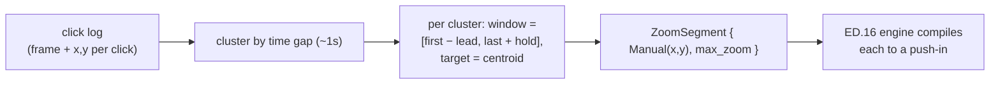

# Auto-zoom from click telemetry — ED.17

In a busy cutting room the assistant editor kept a **continuity log** —
every take, every notable beat, marked against the footage so the editor
knew where the action was without re-screening everything. A screen
recording keeps its own continuity log for free: every place the user
*clicked* is a place their attention went. ED.17 reads that log and marks
up the timeline with proposed push-ins — the assistant's annotations, which
the editor (you) then keeps, nudges, or throws away.



[`auto_zoom_segments`](../../api/edit/telemetry/fn.auto_zoom_segments.html)
is pure arithmetic over a [`ClickEvent`](../../api/edit/telemetry/struct.ClickEvent.html)
list: clicks within ~1 s cluster together; each cluster becomes a zoom that
opens ~0.3 s before the first click, holds `AutoZoomConfig::hold_time_ms`
past the last, and targets the cluster's centroid at `max_zoom`. Sub-half-
second blips are dropped and adjacent windows are clamped so they never
overlap. The output is an ordinary list of [`ZoomSegment`](../../api/edit/zoom/struct.ZoomSegment.html)s
— the [zoom engine](./ed16-zoom-engine.md) compiles them exactly like
hand-authored ones, and the [zoom lane](./ed12-zoom-lane.md) renders them
for editing.

## Capturing the telemetry

The generator consumes a click log + a cursor track; the capture that
*produces* them lives in `app::cursor_capture` (macOS first):

- **Cursor position** — a `CursorPoller` samples the global pointer at ~60 Hz
  via `CGEventCreate(NULL)` + `CGEventGetLocation`, which read the current
  position with **no Input-Monitoring permission** and no event tap.
  `samples_to_track` resamples the timestamped samples onto the project frame
  grid; `normalize_cursor_to_frame` maps display points into the `[0, 1]`
  [`CursorSample`](../../api/edit/telemetry/struct.CursorSample.html)
  convention. Both are pure + unit-tested; the poller thread is runtime-only.

```admonish note title="Clicks + live wiring are the remaining runtime pieces"
The **click log** (the auto-zoom input above + ED.19's ripples) needs a
`CGEventTap` — which *does* require the Input-Monitoring permission and a
`CFRunLoop` callback, so it can't run in CI (ISS-16). Connecting the poller
into the live record→editor flow (start/stop + attach the track to the
project) is the additive, runtime-verified wiring in ISS-17. The generated
zooms are concrete `Manual`-targeted zooms (the click centroid), not `Auto`,
so they punch into the click immediately and stay fully editable.
```
