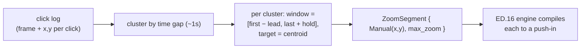

# Auto-zoom from click telemetry — ED.17

In a busy cutting room the assistant editor kept a **continuity log** —
every take, every notable beat, marked against the footage so the editor
knew where the action was without re-screening everything. A screen
recording keeps its own continuity log for free: every place the user
*clicked* is a place their attention went. ED.17 reads that log and marks
up the timeline with proposed push-ins — the assistant's annotations, which
the editor (you) then keeps, nudges, or throws away.



[`auto_zoom_segments`](../../api/edit/telemetry/fn.auto_zoom_segments.html)
is pure arithmetic over a [`ClickEvent`](../../api/edit/telemetry/struct.ClickEvent.html)
list: clicks within ~1 s cluster together; each cluster becomes a zoom that
opens ~0.3 s before the first click, holds `AutoZoomConfig::hold_time_ms`
past the last, and targets the cluster's centroid at `max_zoom`. Sub-half-
second blips are dropped and adjacent windows are clamped so they never
overlap. The output is an ordinary list of [`ZoomSegment`](../../api/edit/zoom/struct.ZoomSegment.html)s
— the [zoom engine](./ed16-zoom-engine.md) compiles them exactly like
hand-authored ones, and the [zoom lane](./ed12-zoom-lane.md) renders them
for editing.

```admonish note title="Concrete targets now; capture is the follow-up"
The generated regions are concrete `Manual`-targeted zooms (the click
centroid), not `Auto` — so they punch into the click *immediately* under
the existing engine rather than falling back to frame-centre, and they're
fully editable. What's deferred is the other half: the **OS-level capture**
that records the click log during a recording (a per-platform surface,
macOS first — `CGEventTap` and friends). The generator that consumes the
log is done and tested; wiring it at import waits on that capture landing.
```
