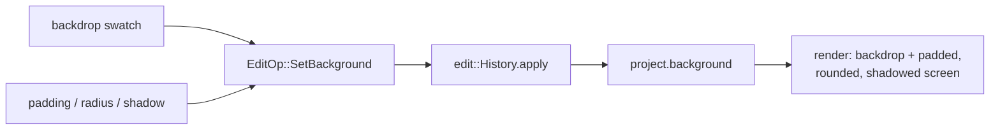

# Inspector Style tab — ED.18

A finished print was never just tacked to the wall — it was **mounted**:
matted with a border, sometimes float-mounted with a shadow so it stood off
the backing board, set against a chosen backdrop. That presentation layer is
exactly what turns a raw screen grab into something that looks produced —
the recording floated on a gradient, padded, rounded, with a soft shadow.
ED.18 is the mount: a Style panel that drives the project's
[`BackgroundConfig`](../../api/edit/style/struct.BackgroundConfig.html).



The [`StyleInspector`](../../api/app_ui/style_inspector/fn.StyleInspector.html)
offers backdrop **swatches** (gradients + flat fills) and numeric **padding /
corner-radius / shadow** fields; each reads the current config, changes one
field, and commits a `SetBackground` through the shared `History` (undoable).
The swatches render the actual backdrop via
[`source_css`](../../api/app_ui/style_inspector/fn.source_css.html) — the
*same* CSS the live canvas backdrop will use — so what you pick is what you
see.

```admonish note title="One non-Copy op — apply now matches by reference"
`BackgroundConfig` owns a wallpaper `String`, so it isn't `Copy` like the
other edit payloads. Adding `SetBackground` meant flipping
`EditProject::apply` from `match *op` (which copies each field out of the
borrow) to `match op` (binding by reference, `clone()`-ing the config) — a
small refactor that also clears the way for any future non-`Copy` op.
```

## From config to pixels

The Style panel authors the values; the renderer draws them. The framing is
two layers, applied once when the config changes (the export sets it at
generator construction; a live preview re-applies on edit) via
[`EditorPreview::set_background`](../../api/screen_app/editor_preview/struct.EditorPreview.html):

- **The backdrop** is a full-NDC `Graphics` rect on the recorder's scene — a
  linear gradient (the default warm→cool diagonal), a flat color, or (later)
  a wallpaper. It carries no clip, so it renders in the advanced-dispatch
  **Phase 1**, behind everything.
- **The screen** is the recording sprite given a `MaskShape::RoundedRect`
  clip set to the *padded window*. The clip makes it a dispatched node — it
  composites **over** the backdrop in **Phase 2**, with the rounded-corner
  SDF cutting its alpha.

The clip lives in fixed output NDC (screen space, not transform-aware), so
the rounded window is a stable frame while the zoom punch-in (ED.16) tightens
*inside* it. Padding folds into the same screen transform as a centered
shrink — `scale *= k`, `position *= k`, with `k = 1 − 2·padding/axis` — so it
composes exactly with crop and zoom (`pad ∘ zoom ∘ crop`). Because the
recorder never calls `set_background_*` / `set_screen_clip`, its scene is
unchanged: no backdrop node, no screen clip, a plain full-bleed compose.

```admonish note title="Shadow + inset render; wallpaper is next (ISS-15)"
`shadow` and `inset` now render: the drop shadow is a dark, offset rounded-rect
the shape of the frame window, drawn *behind* the screen (a Phase-1 unclipped
`Graphics` node like the backdrop) so the offset sliver reads as a shadow — a
hard-edged single-draw-call shadow, deliberately **not** the
lavapipe-incompatible blur, so it stays verifiable on every CI runner. The
inset border is a rounded-rect *stroke* tracing the same window, drawn *over*
the screen (a Phase-2 full-NDC-clipped node like the cursor). A `Wallpaper`
source still falls back to the default gradient (asset pipeline pending —
ISS-15).
```
