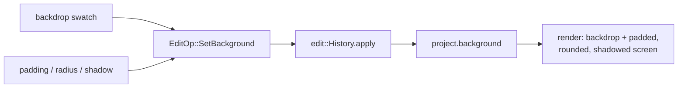

# Inspector Style tab — ED.18

A finished print was never just tacked to the wall — it was **mounted**:
matted with a border, sometimes float-mounted with a shadow so it stood off
the backing board, set against a chosen backdrop. That presentation layer is
exactly what turns a raw screen grab into something that looks produced —
the recording floated on a gradient, padded, rounded, with a soft shadow.
ED.18 is the mount: a Style panel that drives the project's
[`BackgroundConfig`](../../api/edit/style/struct.BackgroundConfig.html).



The [`StyleInspector`](../../api/app_ui/style_inspector/fn.StyleInspector.html)
offers backdrop **swatches** (gradients + flat fills) and numeric **padding /
corner-radius / shadow** fields; each reads the current config, changes one
field, and commits a `SetBackground` through the shared `History` (undoable).
The swatches render the actual backdrop via
[`source_css`](../../api/app_ui/style_inspector/fn.source_css.html) — the
*same* CSS the live canvas backdrop will use — so what you pick is what you
see.

```admonish note title="One non-Copy op — apply now matches by reference"
`BackgroundConfig` owns a wallpaper `String`, so it isn't `Copy` like the
other edit payloads. Adding `SetBackground` meant flipping
`EditProject::apply` from `match *op` (which copies each field out of the
borrow) to `match op` (binding by reference, `clone()`-ing the config) — a
small refactor that also clears the way for any future non-`Copy` op. The
*visible* framing — the drawn backdrop, padding, rounded canvas, and shadow
— composites in the render-integration / export pass (ED.20 / ED.21); this
chunk authors the values and previews the backdrop.
```
