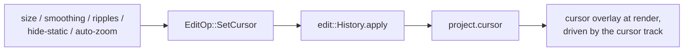

# Inspector Cursor tab — ED.19

In a screen recording the cursor is the only performer on stage — and like
any performer it reads better with a little grooming. Scaled up so it's
findable, its motion smoothed the way a fluid-head dolly tames handheld
jitter, a ripple on each click the way a clapperboard's snap marks the
action, and politely off-stage when it isn't doing anything. ED.19 is the
cursor's dressing room: a panel that edits one
[`CursorConfig`](../../api/edit/style/struct.CursorConfig.html) on the
project.



The [`CursorInspector`](../../api/app_ui/cursor_inspector/fn.CursorInspector.html)
exposes size (clamped to a sane 25–400 %), smoothing, and three toggles —
click ripples, hide-when-static, and *auto-zoom on clicks* (the switch that
feeds [ED.17](./ed17-auto-zoom.md)). Each reads the current config, changes
one field, and commits a `SetCursor` through the shared `History`. Because
`CursorConfig` is `Copy`, the op is a plain field assignment — the
by-reference `apply` refactor [ED.18](./ed18-style.md) introduced for the
non-`Copy` background config carries it for free.

```admonish note title="Authoring now; the overlay with the cursor track"
The composited cursor — a smoothed, scaled pointer with click ripples drawn
as a `wisp` overlay — needs the recorded **cursor track** to drive it, which
comes from the same per-OS telemetry capture [ED.17](./ed17-auto-zoom.md) is
waiting on. So this chunk authors the settings; the visible overlay lands
with the render-integration pass once capture exists. The auto-zoom toggle,
though, is live today: it gates the [generator](./ed17-auto-zoom.md) that's
already built and tested.
```
