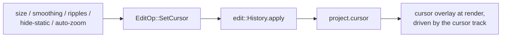

# Inspector Cursor tab — ED.19

In a screen recording the cursor is the only performer on stage — and like
any performer it reads better with a little grooming. Scaled up so it's
findable, its motion smoothed the way a fluid-head dolly tames handheld
jitter, a ripple on each click the way a clapperboard's snap marks the
action, and politely off-stage when it isn't doing anything. ED.19 is the
cursor's dressing room: a panel that edits one
[`CursorConfig`](../../api/edit/style/struct.CursorConfig.html) on the
project.



The [`CursorInspector`](../../api/app_ui/cursor_inspector/fn.CursorInspector.html)
exposes size (clamped to a sane 25–400 %), smoothing, and three toggles —
click ripples, hide-when-static, and *auto-zoom on clicks* (the switch that
feeds [ED.17](./ed17-auto-zoom.md)). Each reads the current config, changes
one field, and commits a `SetCursor` through the shared `History`. Because
`CursorConfig` is `Copy`, the op is a plain field assignment — the
by-reference `apply` refactor [ED.18](./ed18-style.md) introduced for the
non-`Copy` background config carries it for free.

## The overlay at render

The composited cursor is a single `wisp` `Graphics` node drawn over the
framed screen by
[`EditorPreview::render_framed_with_cursor`](../../api/screen_app/editor_preview/struct.EditorPreview.html),
driven by the recorded **cursor track** (`EditProject::cursor_track`):

- a scaled, dark-outlined white **arrow pointer** (a single convex
  `draw_polygon` quad — tip, left edge, tail point, right barb — sized by
  `size_pct`),
- expanding, fading **click ripples** (`draw_ellipse` discs) at each recent
  click, radius growing + alpha decaying across a ~0.4 s window
  ([`ripples_at`](../../api/edit/telemetry/fn.ripples_at.html)),
- **smoothing** as a pure EMA over the track
  ([`cursor_at`](../../api/edit/telemetry/fn.cursor_at.html)),
- **hide-when-static**: a parked pointer fades off-stage
  ([`cursor_is_static`](../../api/edit/telemetry/fn.cursor_is_static.html)),
  but a live click ripple keeps it visible — a click is an action worth
  showing even when the cursor hasn't moved.

```admonish important title="The cursor rides the zoom"
The captured position is normalized to the *source* frame, so the overlay is
mapped through the **same** crop / zoom / padding transform as the screen
sprite — the pointer stays glued to the exact pixel it was over and magnifies
*with* the auto-zoom punch-in, rather than drifting off the button it
clicked. A GPU test asserts the same source point lands further from centre
under a zoom (rides-the-transform, not output-space pinning).
```

```admonish note title="The track comes from capture (ED.17)"
The overlay renders from a recorded **or synthetic** track (and is tested
with a synthetic one, so it's gate-green without real capture). The recorded
track is produced by the per-OS telemetry capture in
[ED.17](./ed17-auto-zoom.md). The pointer is a vector arrow glyph and
`hide_static` is honored at render; a pixel-sampled native cursor bitmap
remains a possible future nicety, not a gap.
```
