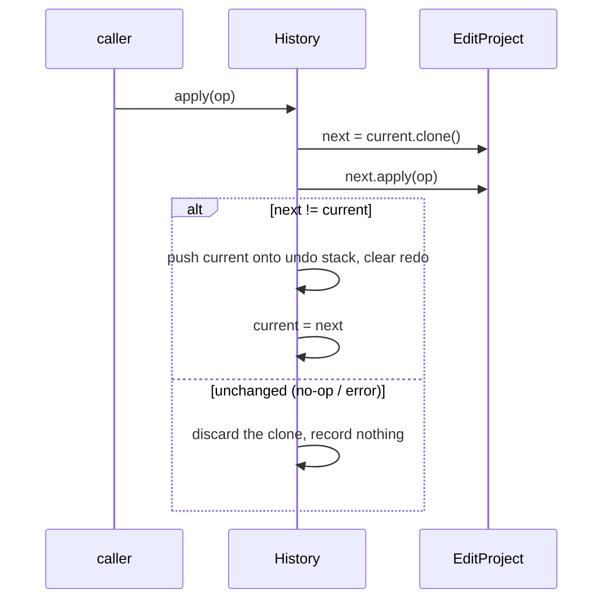

# Edit operations + undo/redo — ED.2

Every timeline edit is an [`EditOp`](../../api/edit/ops/enum.EditOp.html)
applied to the project — a small, validated, invariant-preserving
mutation. Undo/redo wraps them in a [`History`](../../api/edit/history/struct.History.html).

## The operations

```mermaid
classDiagram
  class EditOp {
    <<enum>>
    Split { at }
    Trim { index, edge, to }
    RippleDelete { start, end }
    SetSpeed { index, timescale }
    AddZoom { zoom }
    RemoveZoom { id }
    MoveZoom { id, start, end }
  }
```

- **Split** cuts the segment under a project frame into two (a no-op on a
  boundary). **Trim** moves a segment's in/out point, clamped so it stays
  non-empty and inside the source. **RippleDelete** removes a project
  range and closes the gap — the surviving pieces simply concatenate.
  **SetSpeed** sets a segment's `timescale` (sanitized to a finite,
  positive multiplier).
- **AddZoom / RemoveZoom / MoveZoom** edit the zoom list, which stays
  sorted by start frame; ids are assigned fresh on insert so move/remove
  can address a zoom stably as the list changes.

## Undo without fragile inverses

`History::apply` doesn't derive a per-operation inverse (which is
error-prone for splits and ripples). Instead it applies the operation to
a **clone** and commits only if the project actually changed:



```admonish important title="apply+undo == identity, by construction"
Because the prior state is snapshotted verbatim, `undo` restores it
exactly — no inverse-operation bugs are possible. No-op and failed
operations record nothing, so the undo stack only holds real changes.
This property is proved by `proptest`: random operation sequences always
preserve the project's invariants, and undoing them all returns to the
starting project.
```

> The **lift-delete** variant (delete a range but leave a black gap)
> needs a timeline "gap" item the segment model doesn't yet have; it is
> deferred (see `_docs/ISSUES.md`). Ripple-delete is the primary delete,
> which is what the timeline UI (ED.11) leads with.
