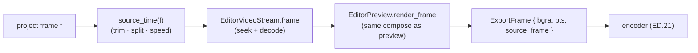

# Deferred export frame generator — ED.20

The optical printer was the lab's export stage: a camera and a projector
locked together, re-photographing the cut negative one frame at a time onto
fresh stock, honoring every splice and speed change as it advanced. ED.20 is
that printer in software. Given an `EditProject`, the
[`ExportFrameGenerator`](../../api/screen_app/editor_export/struct.ExportFrameGenerator.html)
walks the *project* frames `0..project_duration` and, for each, prints the
right source frame onto the output.



The key is that the timeline edits are *already* baked into the frame
*selection*: [`source_time`](../../api/edit/project/struct.EditProject.html#method.source_time)
maps each project frame to its source frame, so a trimmed clip starts later,
a split is invisible (two segments, one continuous source walk), and a 2×
segment advances the source twice as fast. The generator composes through
the **same** [`EditorPreview`](./ed6-preview.md) path the live preview uses,
so the exported file matches the cut you scrubbed. Each `ExportFrame` carries
a PTS computed with the *same* formula the live recorder's encoder feed uses,
so timestamps line up when ED.21 hands the stream to the encoder.

```admonish important title="Forward-only — the decoder never re-spawns"
Project frames are visited in order, and the edit ops never reorder the
timeline, so the source frames the generator requests are monotonic
non-decreasing. `EditorVideoStream` only re-spawns its decode pipeline on a
*backward* seek — so a full export is a single forward decode pass. The
golden test asserts `spawn_count() == 1` after generating every frame of a
trim-plus-speed project, locking that invariant in (a regression that
reorders or seeks backward would trip it immediately).
```

```admonish note title="Frame selection now; visual transforms next"
This chunk nails the frame-accurate *timeline walk* — trim, split, and speed
are all honored, verified deterministically without a GPU-visual check. The
cinematic *visual* edits (zoom punch-ins, crop reframe, background framing)
apply as a transform on the composed screen sprite; that render-integration
step lands next, where the crop-then-zoom NDC math gets the visual
verification a headless golden frame can't provide.
```
