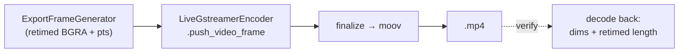
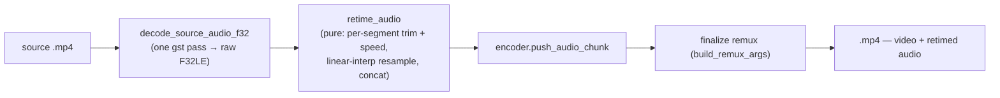

# End-to-end edited export — ED.21

The lab's last step was the **answer print**: the first complete, projectable
reel struck from the cut negative — every splice, speed change, and trim
finally baked into something you could screen. ED.21 strikes that print.
[`export_edited_project`](../../api/screen_app/editor_export/fn.export_edited_project.html)
drives the [frame generator](./ed20-export-generator.md) into the encoder and
finalizes a real `.mp4`.



The encoder is the **live recorder's `LiveGstreamerEncoder`, reused
unchanged** — the editor's export and the recorder's capture write through
the exact same `vtenc → h264parse → mp4mux` pipeline, so there's one encode
path to trust. The export loop is synchronous and polls a `cancel` flag plus
calls an `on_progress(done, total)` callback once per frame — the hooks the
export UI (ED.22) drives. The gst-guarded end-to-end test exports a 2×-speed
project and then **decodes the result back** with `EditorVideoStream`,
asserting the output is a valid container at the source dimensions whose
length is the *retimed* (halved) duration — proof the edit reached the file,
verified with our own decoder rather than a brittle byte golden.

## The audio rides the same timeline

The generator bakes the *visual* edits in (trim/split/speed via `source_time`,
the zoom punch-in (ED.16), crop/aspect (ED.15), and background framing
(ED.18)). Audio gets the same treatment, with the project's "`GStreamer` owns
the intake; Rust owns the edit arithmetic" split:



One `gst-launch` pass decodes the whole source audio to raw interleaved F32LE;
`retime_audio` then slices it **in pure Rust** — for each segment, the source
sample-frame range resampled to that segment's project duration (a 2× segment
emits half the sample-frames; linear interpolation keeps it click-free) — and
the result feeds the encoder's audio scratch, so the recorder's *existing*
finalize remux muxes it onto the retimed video. The end-to-end test builds an
audio-bearing source and proves the export carries a retimed audio track.

```admonish note title="Speed shifts pitch; pitch-correction is a follow-up"
Resampling for speed changes pitch with tempo (a 2× segment sounds higher) —
the common screen-recording convention. A pitch-preserving retime
(`scaletempo`) is a deferred polish, as are wallpaper backdrops and the
drop-shadow (ISS-14 / ISS-15). The visual transforms and the audio retime both
layer onto this same generator → encoder spine without changing it.
```
