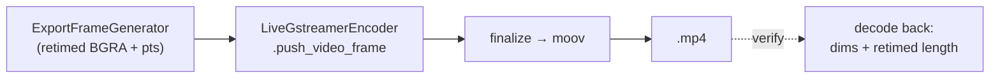

# End-to-end edited export — ED.21

The lab's last step was the **answer print**: the first complete, projectable
reel struck from the cut negative — every splice, speed change, and trim
finally baked into something you could screen. ED.21 strikes that print.
[`export_edited_project`](../../api/screen_app/editor_export/fn.export_edited_project.html)
drives the [frame generator](./ed20-export-generator.md) into the encoder and
finalizes a real `.mp4`.



The encoder is the **live recorder's `LiveGstreamerEncoder`, reused
unchanged** — the editor's export and the recorder's capture write through
the exact same `vtenc → h264parse → mp4mux` pipeline, so there's one encode
path to trust. The export loop is synchronous and polls a `cancel` flag plus
calls an `on_progress(done, total)` callback once per frame — the hooks the
export UI (ED.22) drives. The gst-guarded end-to-end test exports a 2×-speed
project and then **decodes the result back** with `EditorVideoStream`,
asserting the output is a valid container at the source dimensions whose
length is the *retimed* (halved) duration — proof the edit reached the file,
verified with our own decoder rather than a brittle byte golden.

```admonish note title="Faithful + retimed today; audio + visuals next"
The export is **video-only and retimed** right now: trim, split, and speed
are baked into the frame stream, producing a correct, playable `.mp4`. Two
additive passes complete the picture: the **per-segment audio retime** (a
second `GStreamer` leg — trim + speed + concat + mux, via a unit-testable
`build_edited_audio_args`, per the [export plan](https://github.com/eng-manager-xyz/Screen)),
and the **cinematic visual transforms** (zoom / crop / background) from the
render-integration step. Both layer onto this same generator → encoder spine
without changing it.
```
