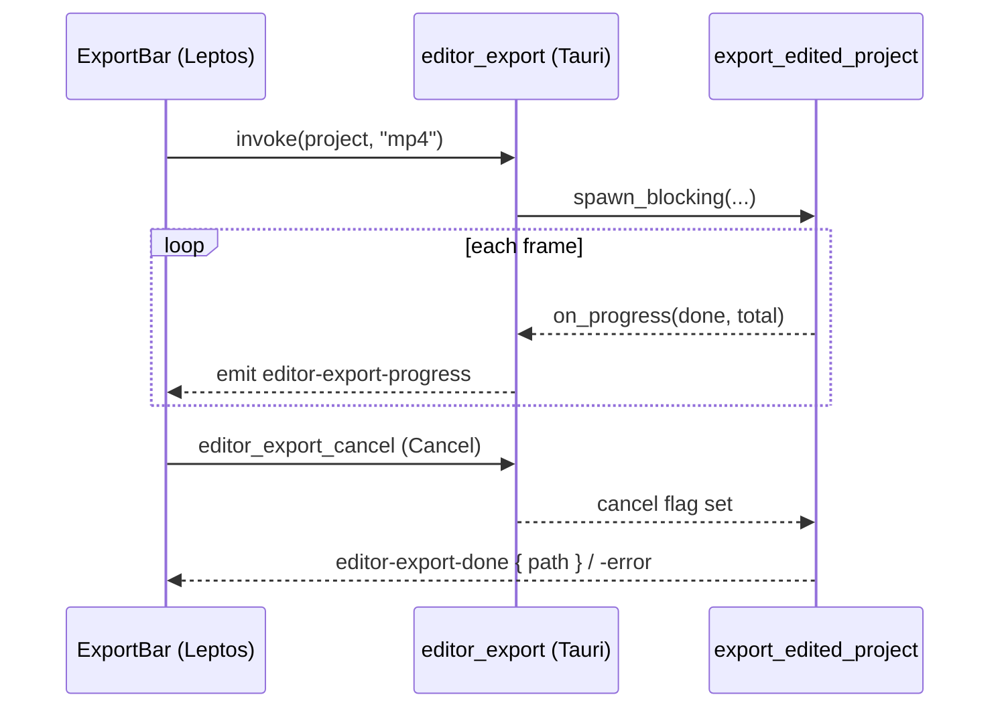

# Export progress + cancel UI — ED.22

Striking a print took minutes, and the lab tech didn't just walk away — they
watched the footage counter climb and could halt a bad run before it wasted
the whole reel. ED.22 is that counter and that stop button: an
[`ExportBar`](../../api/app_ui/export_bar/fn.ExportBar.html) that turns
[ED.21](./ed21-export.md)'s export into a visible, interruptible job.



The backend `editor_export` command runs the export on the blocking pool
(so the webview stays live), deriving the output path beside the recordings
folder and emitting `editor-export-progress` throttled to ~100 events over
the run. A shared `AtomicBool` (raised by `editor_export_cancel`) is the
stop button — the export loop polls it each frame. The progress / done /
error events ride the same `__TAURI__.event → CustomEvent → signal` bridge
the rest of the editor uses, landing in an
[`ExportUiState`](../../api/app_ui/editor_ipc/enum.ExportUiState.html) the
bar renders: **Export** when idle, a **progress bar + Cancel** while
running, and the output path (or error) when done.

```admonish note title="The hooks were already there"
ED.21 built `export_edited_project` with a `cancel: &AtomicBool` and an
`on_progress(done, total)` callback precisely so this chunk would be pure
wiring — no change to the generator→encoder spine. The percent math
([`export_percent`](../../api/app_ui/editor_ipc/fn.export_percent.html)) is
a tiny pure, tested function; everything else is the command, the event
bridge, and the reactive bar.
```
