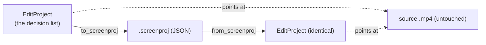

# Project persistence — `.screenproj` — ED.23

When the CMX 600 turned editing into a *decision list*, that list became the
thing you filed in the can beside the negative: reopen the can, feed the
list back, and you had your cut — no frame of original ever copied. ED.23 is
that can. Because an [`EditProject`](../../api/edit/project/struct.EditProject.html)
is *only* value types — segment ranges, zoom windows, framing config, a
pointer at the source — saving it is just serializing the decision list to
JSON, and reopening it is parsing the JSON back.



[`edit::persist`](../../api/edit/persist/index.html) is the whole format:
`to_screenproj` / `from_screenproj` over `serde_json`, pretty-printed so the
file is human-readable and diff-friendly. The round-trip is **lossless and
pure** — proven without touching the filesystem — so save↔reload is
identical by construction. On the shell side, `editor_save_project` writes
`<recording>.screenproj` beside the source and `editor_load_project` reads
it back; the **Save** button in the editor lives next to Export.

```admonish note title="`serde_json` joins `edit` — and it stays wasm-clean"
`edit` was deliberately serde-only; persistence promotes `serde_json` from a
dev-dependency to a real one. It's wasm-safe (no filesystem of its own — the
*file* I/O lives in the native `app` commands), so `edit` remains
GPU-free **and** wasm-clean, and the round-trip test runs in the gate with
no GPU or disk. The file carries a
[`SCHEMA_VERSION`](../../api/edit/project/constant.SCHEMA_VERSION.html) so a
future format change migrates rather than mis-parses.
```
