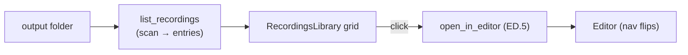

# Recordings library + open-in-editor — ED.24

Every cutting room had a shelf of cans — the finished reels, racked and
labelled, ready to pull down onto the bench. ED.24 is that shelf: the
recordings in your output folder, shown as tiles, each one a click away from
the editor.



The backend `list_recordings` command scans the recordings folder; the pure,
tested [`recording_entries`](../../api/screen_app/editor_command/fn.recording_entries.html)
turns that listing into entries — every `.mp4`, newest first, flagged if a
saved `.screenproj` ([ED.23](./ed23-persistence.md)) sits beside it. The
[`RecordingsLibrary`](../../api/app_ui/recordings_library/fn.RecordingsLibrary.html)
grid renders them through the same `__TAURI__.event → CustomEvent → signal`
bridge the rest of the editor uses, and a click reuses the
[ED.5](./ed5-editor-surface.md) `open_in_editor` handoff before flipping the
nav rail to the editor — closing the **Record → Edit → Export** loop the
whole milestone set out to build.

```admonish note title="Functional grid now; the showcase card later"
This is the working library — list, tile, click-to-open. The richer
storybook `RecordingCard` (poster thumbnails, processing overlays, metrics)
is the design target the tiles adopt once clip posters + a thumbnail
pipeline land. Opening a recording today builds a fresh project; opening the
*saved* `.screenproj` via `editor_load_project` (backend-ready from ED.23) is
the next refinement.
```
