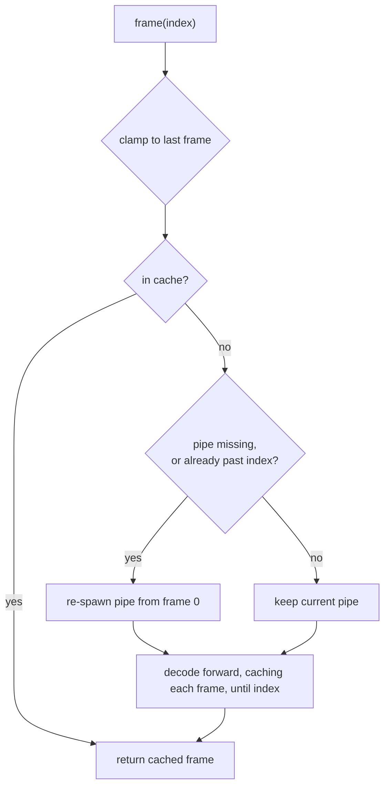

# Random-access decode — ED.3

The recorder's decoder
([`GstreamerPipeStream`](../../api/decode/gstreamer_pipe/struct.GstreamerPipeStream.html))
streams BGRA frames forward only — perfect for playback, useless for an
editor that scrubs to arbitrary frames.
[`EditorVideoStream`](../../api/decode/editor_stream/struct.EditorVideoStream.html)
wraps it with **frame-indexed seeking** and a bounded decoded-frame cache.

## How a seek resolves



A forward seek keeps pulling from the live pipe; a backward seek (before
the pipe's current position) re-spawns from frame 0 and decodes up to the
target. Every decoded frame is cached (LRU), so local scrubbing and
repeated access are cheap, and **export — which walks frames in order —
never re-spawns**.

```admonish warning title="gst-launch has no CLI seek — this is forward-decode"
`gst-launch-1.0` exposes no command-line seek (no `-ss`), so a true jump
to the enclosing keyframe isn't available the way `gstreamer-rs`'s
`seek_simple(ACCURATE)` would be. The v1 therefore forward-decodes: a
backward seek in a long clip re-spawns and decodes from the start (the
cache hides this for nearby frames). Swapping in a real `gstreamer-rs`
`ACCURATE` seek later is a one-site change behind `EditorVideoStream` —
the rest of the editor only sees `frame(index)`.
```

Correctness is proven directly: the integration test decodes the fixture
both ways and asserts `frame(n)` is **byte-identical** to forward-decoding
to `n`; a separate test asserts cached frames don't bump
[`spawn_count`](../../api/decode/editor_stream/struct.EditorVideoStream.html#method.spawn_count),
and out-of-range indices clamp to the last frame.
