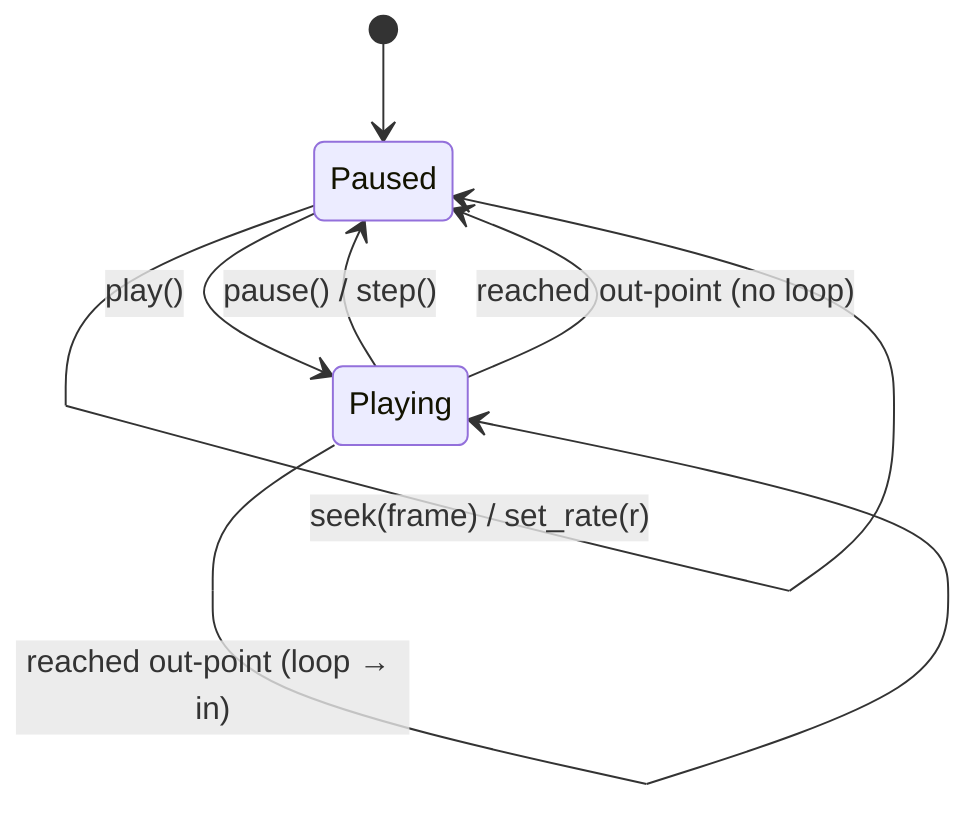

# Playback clock — ED.4

The recorder's player is wall-clock paced and 1× only. The editor needs a
clock that is the single authority over time —
[`EditorPlayer`](../../api/playback/editor_player/struct.EditorPlayer.html):
seek to an exact frame, step a frame at a time, play at a chosen rate,
honour in/out points, and loop.



Time is measured in **project frames** at the project fps. `tick(dt)`
advances the playhead by `dt × fps × rate`; `current_frame()` is
`floor(elapsed × fps)`, clamped to the playable range `[in, out)`. At the
end of the range the clock loops back to the in-point or clamps to the
last frame and pauses.

```admonish important title="One clock for playhead AND zoom"
`EditorPlayer` wraps `wisp_animation::Driver` rather than rolling its own
timer — and exposes it via `driver()`. That's deliberate: the zoom
animation engine (ED.16) samples its keyframed Tracks against this *same*
Driver, so the playhead and the cinematic zoom advance in perfect
lockstep, in realtime preview and in deterministic export alike. A second
clock would let them drift.
```

```admonish note title="Realtime vs fixed"
`EditorPlayer::new` builds a realtime clock (the caller injects `dt` from
the render loop). `EditorPlayer::fixed` advances exactly one frame per
`tick`, ignoring `dt` — the reproducible stepping the export pipeline
(ED.20) uses so every render is bit-stable. Both share the identical
frame math, so preview and export agree frame-for-frame.
```
