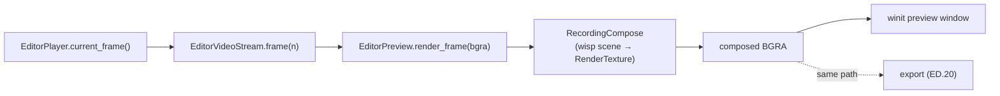

# Editor preview canvas — ED.6

The editor needs to show the frame under the playhead. `EditorPreview`
composes it — and does so through the **same compositor the recorder
uses**, so there's one render path to reason about (and, later, exact
preview/export parity).



`EditorPreview` wraps the proven
[`RecordingCompose`](../../api/screen_app/recording_compose/struct.RecordingCompose.html)
but feeds it from the seekable `EditorVideoStream` at the playhead instead
of live capture slots. The recorded clip is already a fully-composited
frame (any webcam bubble was baked in at record time), so it's shown
full-frame; the scene's camera channel stays idle.

```admonish important title="One compose path → preview == export"
Driving the preview and the export (ED.20) through the *same*
`RecordingCompose` is deliberate: it's the cheapest possible guarantee
that what you see while editing is exactly what renders to the `.mp4`. A
separate "preview renderer" would be a parity bug waiting to happen.
```

```admonish note title="What lands later"
This chunk is the compose-at-playhead pump (unit-tested: a source frame in
→ a correctly-sized composed BGRA out). Two pieces layer on next: the
**cinematic framing** — gradient background, padding, rounded corners,
drop shadow — arrives with its inspector controls in ED.18 (it needs care
against wisp's batch-by-type renderer, so it gets its own chunk); and the
live `winit` preview **window** follows the `preview` crate's pattern and
is verified by running the app (it can't render in the headless gate).
```
