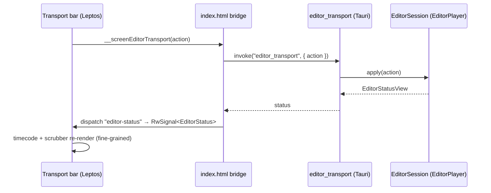

# Playback transport — ED.7

Full basic playback: play/pause, frame-step, jump-to-ends, a scrubber, a
speed selector, and a `MM:SS.ff` timecode — wired to the backend playhead.



The clock lives in the **backend** — an `EditorSession` wrapping the
[`EditorPlayer`](../../api/playback/editor_player/struct.EditorPlayer.html)
from ED.4. The webview is a thin transport that sends one enum-dispatched
[`editor_transport`](../../api/screen_app/editor_session/fn.editor_transport.html)
command and renders the returned status.

```admonish important title="The host injects dt — so the UI drives the tick"
`EditorPlayer`/`Driver` never read a wall clock; the host supplies `dt`.
So while playing, the UI runs a 33 ms loop sending `Tick { dt_ms }` and the
backend clock advances — the timecode and scrubber move in lockstep. The
tick loop is created **once** at the app root (not in the surface) so
switching surfaces can't spawn duplicate loops. When the native preview
window lands it drives the same tick and renders the frame at
`current_frame`.
```

| Key | Action |
|---|---|
| `Space` | Play / pause |
| `←` / `→` | Step back / forward one frame (`Shift` = 5) |
| `I` / `O` | Set in / out point at the playhead |
| speed selector | 0.5× / 1× / 2× preview rate |

The timecode formatter (`format_timecode`) renders `MM:SS.ff` (frames
within the second) and is unit-tested across boundaries; the scrubber and
timecode use fine-grained reactivity so only they re-render as the
playhead advances — the speed selector and buttons stay put.
