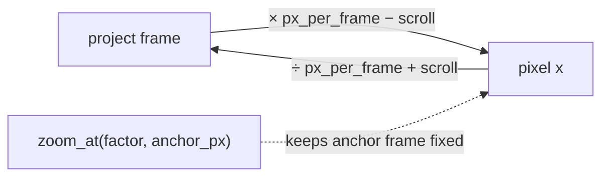

# Timeline ruler + coordinate system — ED.8

The timeline needs one shared map between **project frames** and **screen
pixels** — for the ruler, the lanes (ED.9–12), the playhead, and snapping
(ED.11). That map is [`TimelineViewport`](../../api/app_ui/timeline_view/struct.TimelineViewport.html):
a zoom (`px_per_frame`), a scroll (`scroll_frame`), and the tick math.



- **`frame_to_px` / `px_to_frame`** round-trip exactly.
- **`zoom_at(factor, anchor_px)`** zooms while holding the frame under the
  anchor pixel fixed — so zooming centred on the playhead keeps the
  playhead put (a hard NLE expectation).
- **`pan_px`** scrolls, clamped so you can't scroll past either end.
- **`ruler_ticks`** emits labeled ticks at a "nice" second interval
  (1/2/5/10/15/30/60/…s) chosen so labels never crowd — frame-correct at
  every zoom.

The [`TimelineRuler`](../../api/app_ui/timeline_view/fn.TimelineRuler.html)
component renders a **fit-to-width** ruler — the full-clip "global
progress" view the ticket calls for, decoupled from per-lane zoom — with
those tick labels, a reactive playhead bound to the editor status, and
click-to-seek (clicked fraction → `Seek`).

```admonish note title="The math is the contract"
Everything testable about the timeline lives in `TimelineViewport` and is
unit-tested at multiple zooms (round-trip, zoom-keeps-anchor, scroll
clamp, frame-correct ticks). Binding interactive **wheel-zoom / drag-pan
gestures** to it is a thin follow-on layer — the coordinate math they'd
drive is already done and verified, and the fit-to-width ruler is the
useful default until then.
```
