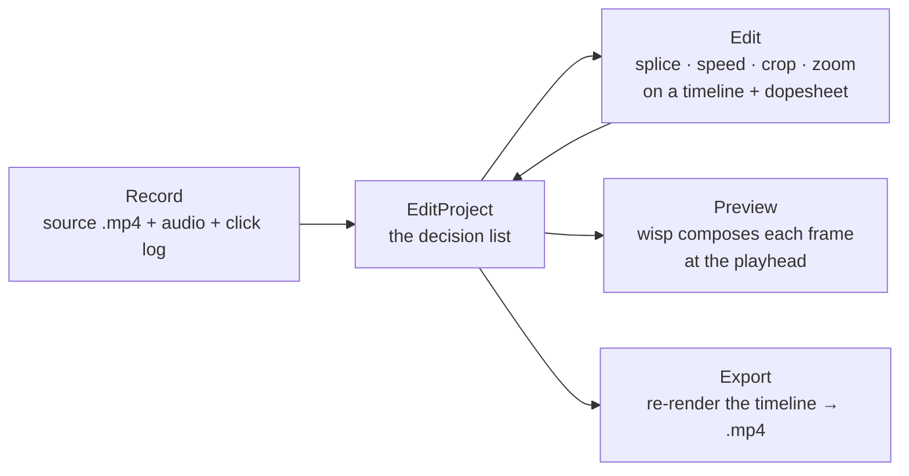

# The editor — Record → Edit → Export (M-EDIT)

If the recorder is the [theatre](../orientation/metaphor.md), the editor is
the **cutting room** — and a cutting room has a hundred-year history worth
borrowing. In 1924 Iwan Serrurier built the Moviola so an editor could run
film *backward and forward* and stop on a frame; the Steenbeck flatbed made
that scrubbing fluid; cuts were a razor blade and a strip of tape; nothing
was thrown away — outtakes hung in the **trim bin**; SMPTE timecode (1967)
gave every frame an address; and in 1971 the CMX 600 dragged the whole
craft from cutting the negative to **non-linear editing** — edit by
*decision list*, never touch the source.

That arc is the design. This editor is the cutting room in software: a
non-destructive **edit decision list**, a scrubbable flatbed over a
forward-only decoder, frame-addressed by a single clock, re-rendered at
export. Each chunk retraces one step:

| Cutting room | Our chunk |
|---|---|
| The reel of negative — frames held to the light | **ED.9** video filmstrip |
| Edit by decision list, never cut the negative | **ED.1** `EditProject` |
| The trim bin — nothing is ever lost | **ED.2** undo / redo |
| The Moviola / Steenbeck flatbed — scrub *both* ways | **ED.3** random-access decode |
| SMPTE timecode — every frame has an address | **ED.4** frame-indexed clock |
| The jog/shuttle wheel, J-K-L | **ED.7** transport |
| The footage counter on the bench | **ED.8** timeline ruler |
| The mag track running beside the picture | **ED.10** audio waveform |
| The razor + tape splice | **ED.11** split / ripple / undo |
| The exposure sheet — moves planned per frame | **ED.12** zoom lane |
| Step- / skip-printing — slow & fast motion | **ED.14** per-segment speed |
| The hard matte + pan-and-scan | **ED.15** crop + aspect |
| The rostrum camera's slow push-in | **ED.16** zoom engine |
| The assistant editor's continuity log | **ED.17** auto-zoom from clicks |
| The optical printer baking it to a print | **ED.20–21** export |

```admonish tip title="Why frame it this way"
The same reason the theatre metaphor earns its keep: when a feature maps
cleanly onto a cutting-room tool, its shape is half-decided already. A
"clip" is a strip of negative; a "cut" is a splice; "undo" is the trim
bin. The history isn't decoration — it's a design oracle.
```

## The flow



## The one idea: an edit is a decision list, not a re-cut negative

The editor never rewrites the recording. Every edit is a small,
serializable value stored in an [`EditProject`](../api/edit/project/struct.EditProject.html):

- an ordered list of **timeline segments** — slices of the source clip.
  Trimming moves a slice's edges; splitting replaces one slice with two;
  changing speed sets a slice's `timescale`.
- a list of **zoom regions** — cinematic punch-ins, each compiled to a
  keyframed transform at render time.
- one **background / cursor / crop / aspect** config — the produced
  "framing" look.

The renderer (`wisp`) and encoder (`media`) re-derive every frame from that
model at preview and export time. Editing stays non-destructive, preview
and export share one code path (so they match), and the whole edit model is
exhaustively unit-testable without a GPU — the modern descendant of "never
cut the negative."

```admonish important title="Why this shape"
The data model proven by Cap's open-source editor and implied by Screen
Studio's zoom/background pipeline: encode the edit as lists of value types
— not a mutated media buffer — and trim, split, speed, undo/redo, and
deterministic re-export all fall out as simple operations on a list. It is
the [edit decision list](https://en.wikipedia.org/wiki/Edit_decision_list),
sixty years on.
```

## Chapters

- [The edit model — ED.1](./chunks/ed1-edit-model.md)
- [Edit operations + undo/redo — ED.2](./chunks/ed2-edit-ops.md)
- [Random-access decode — ED.3](./chunks/ed3-random-access-decode.md)
- [Playback clock — ED.4](./chunks/ed4-playback-clock.md)
- [Editor surface + handoff — ED.5](./chunks/ed5-editor-surface.md)
- [Editor preview canvas — ED.6](./chunks/ed6-preview.md)
- [Playback transport — ED.7](./chunks/ed7-transport.md)
- [Timeline ruler + coordinate system — ED.8](./chunks/ed8-timeline-ruler.md)
- [Video track + clip selection — ED.9](./chunks/ed9-filmstrip.md)
- [Audio waveform lane — ED.10](./chunks/ed10-waveform.md)
- [Splitting, ripple-delete + undo/redo — ED.11](./chunks/ed11-editing.md)
- [The zoom lane — ED.12](./chunks/ed12-zoom-lane.md)
- [Per-segment speed — ED.14](./chunks/ed14-speed.md)
- [Crop + aspect reframe — ED.15](./chunks/ed15-crop-aspect.md)
- [The zoom engine — ED.16](./chunks/ed16-zoom-engine.md)
- [Auto-zoom from click telemetry — ED.17](./chunks/ed17-auto-zoom.md)
