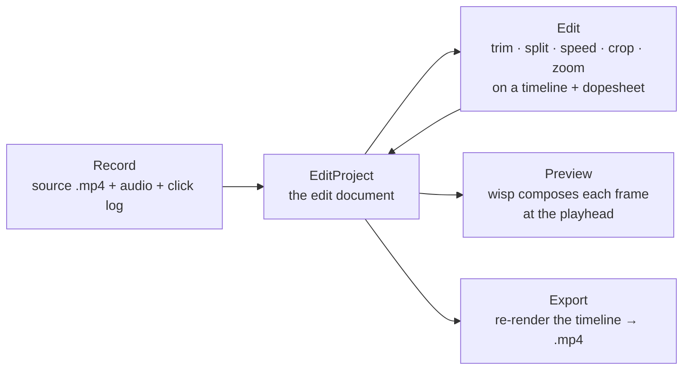

# The editor — Record → Edit → Export (M-EDIT)

After you stop a recording, the clip opens in a non-destructive
**editor**: scrub and play with full transport, trim / split / ripple
clips, change clip speed, crop and reframe, and add cinematic zoom
regions on a layer + dopesheet timeline — then export the edited result
back to an `.mp4`.



## The one idea: an edit is a list of values, not a rewritten file

The editor never rewrites the recording. Every edit is a small,
serializable value stored in an [`EditProject`](../api/edit/project/struct.EditProject.html):

- an ordered list of **timeline segments** — slices of the source clip.
  Trimming moves a slice's edges; splitting replaces one slice with two;
  changing speed sets a slice's `timescale`.
- a list of **zoom regions** — cinematic punch-ins, each compiled to a
  keyframed transform at render time.
- one **background / cursor / crop / aspect** config — the produced
  "framing" look (wallpaper, padding, rounded corners, shadow, cursor
  smoothing, reframe).

The renderer (`wisp`) and encoder (`media`) re-derive every frame from
that model at preview and export time. Editing stays non-destructive,
preview and export share one code path (so they match), and the whole
edit model is exhaustively unit-testable without a GPU.

```admonish important title="Why this shape"
This is the data model proven by Cap's open-source editor and the same
shape Screen Studio's zoom/background pipeline implies. Encoding the
edit as lists of value types — rather than a mutated media buffer — is
what makes trim, split, speed, undo/redo, and deterministic re-export
all fall out as simple operations on a list.
```

## Chapters

- [The edit model — ED.1](./chunks/ed1-edit-model.md) — `EditProject`,
  timeline segments, zoom regions, and the project↔source frame mapping.
