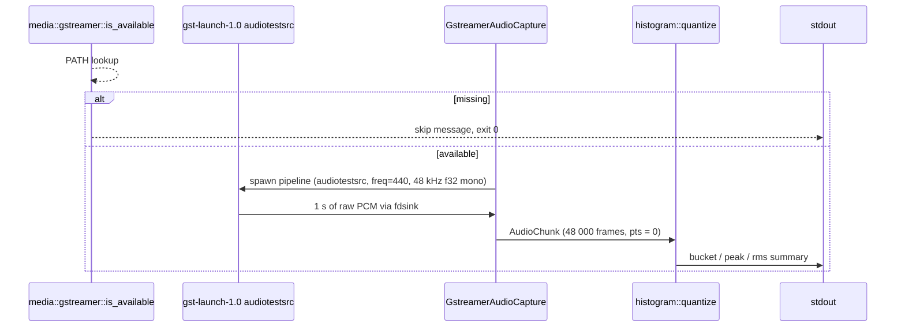

# GStreamer audio → histogram example

[Linear: AUT-107](https://linear.app/harwood/issue/AUT-107)

Closes the loop: the same `histogram::quantize` that drove
[the synthetic Wisp story](audio-histogram.md) accepts real-shape
chunks from a GStreamer `audiotestsrc`. Swap `audiotestsrc` for a
microphone (M-MEDIA.15) and the rest of the pipeline doesn't move.

## What the example does



```admonish important title="Skip-guard, not fail"
The example calls
[`media::gstreamer::is_available`](../api/media/gstreamer/fn.is_available.html)
first and prints a friendly skip message when `gst-launch-1.0` isn't
on `PATH`. That's the M-MEDIA.1 helper. The example is wired into
the manual-regression workflow, not the gate — CI exercises the
audio path through the integration tests that use the same probe.
```

## Run

```sh
cargo run -p media --example gst_audio_histogram
```

Sample output on a machine with GStreamer installed:

```text
GStreamer audiotestsrc → AudioHistogram
  source        : audiotestsrc freq=440.0 Hz
  format        : 1 ch, 48000 Hz, f32 LE
  chunk         : 48000 frames, pts = 0 ns
  bucket / bars : 50 ms × 20 bars
  peak max      : 0.8000
  rms  min..max : 0.5657 .. 0.5657
  first 5 bars  :
    pts=         0 ns  peak=0.8000  rms=0.5657
    pts=  50000000 ns  peak=0.8000  rms=0.5657
    …
```

```admonish note title="Why 0.5657, not 0.7071"
A full-scale sine of amplitude `A` has `RMS = A / √2`. GStreamer's
`audiotestsrc` defaults to `volume = 0.8`, not 1.0 — so `RMS ≈ 0.8 /
√2 ≈ 0.5657`. The synthetic
[`SineWaveSource`](../api/media/mock_audio/struct.SineWaveSource.html)
in [the storybook story](audio-histogram.md) was constructed with
amplitude 0.6, so its bars come in at `RMS ≈ 0.4243`. Same math,
different `A`.
```

## Manual regression

Run the example and verify:

| Field | Expected |
| --- | --- |
| `format`        | `1 ch, 48000 Hz, f32 LE` |
| `chunk frames`  | `48000` |
| `bars`          | `20` (1 s / 50 ms) |
| `peak max`      | `~0.80` |
| `rms` range     | All bars `≈ 0.5657`, near-zero variance |
| `pts` cadence   | `50_000_000` ns per bar, monotonic |

## Next

[Wisp media texture handoff for video frames](video-texture.md) — the
video-side equivalent of this audio path. Takes a captured
`VideoFrame` and uploads it to a wisp `Texture` so a `Sprite` can
sample it.
