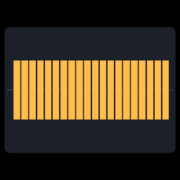

# Audio histogram in Wisp

[Linear: AUT-106](https://linear.app/harwood/issue/AUT-106)

The seam works. `media` quantizes audio into an
[`AudioHistogram`](../api/media/histogram/struct.AudioHistogram.html),
[`media::waveform::mono_bars`](../api/media/waveform/fn.mono_bars.html)
lays it out as rectangle geometry, and `wisp`'s graphics pipeline
draws those rectangles. Wisp never imports `media`.



A 440 Hz sine at amplitude 0.6, sampled at 48 kHz for 1 second,
quantized at 50 ms (20 bars), mirrored about the centerline. Every
bar is roughly the same height — that's the constant-amplitude sine
made visible.

## End-to-end path

```mermaid
sequenceDiagram
    participant Mock as media::SineWaveSource
    participant Hist as media::histogram::quantize
    participant Geom as media::waveform::mono_bars
    participant Wisp as wisp::Graphics

    Mock->>Hist: AudioChunk (1s, 48 kHz mono)
    Hist->>Geom: AudioHistogram (20 × peak, rms)
    Geom->>Wisp: Vec&lt;WaveformBarRect&gt;
    Wisp->>Wisp: graphics.draw_rect(x, y, w, h) ×20
```

```admonish important title="One-way boundary"
The arrows only go right. `wisp` exposes `Graphics::draw_rect`; the
audio side feeds it. Adding a `wisp::audio` module would have pulled
GStreamer (+ build deps + licenses) into every wisp consumer —
storybook, headless export, future plugins. Routing through typed
geometry is what keeps the renderer slim.
```

## Story code (excerpt)

```rust
use media::{audio::AudioFormat, clock::MediaDuration,
            histogram::quantize, mock_audio::SineWaveSource,
            waveform::{mono_bars, BarMetric, WaveformDisplayMode, WaveformLayout}};
use wisp::{Color, Fill, Graphics, math::Rect};

let mut src = SineWaveSource::new(AudioFormat::mono_f32(48_000), 440.0, 0.6);
let chunk = src.next_chunk(48_000);                       // 1 s
let histogram = quantize(&chunk, MediaDuration::from_millis(50)); // 20 bars

let layout = WaveformLayout {
    origin_x: -0.85, baseline_y: 0.0,
    bar_width: 0.075, bar_gap: 0.012,
    max_height: 1.1,
    color: [1.0, 0.74, 0.30, 1.0],
    metric: BarMetric::Peak,
    mode: WaveformDisplayMode::Mirrored,
};
let rects = mono_bars(&histogram, &layout);

let mut bars = Graphics::new();
let [r, g, b, a] = layout.color;
bars.fill(Fill::Solid(Color::rgba(r, g, b, a)));
for rect in &rects {
    bars.draw_rect(Rect::new(rect.x, rect.y, rect.width, rect.height));
}
```

The full story is in
[`crates/wisp-storybook/src/stories/s_audio_histogram.rs`](../api/wisp_storybook/index.html).

```admonish note title="Determinism"
Mock sources + integer-arithmetic quantization mean the rendered
PNG is identical run-to-run on the same GPU. The story is also
under the storybook's `story_fingerprints` quadrant snapshot — any
geometry / color regression in `media::waveform` or `wisp::Graphics`
trips the snapshot.
```

## Next

[GStreamer audio → histogram example](audio-histogram-gst.md) swaps
the mock source for a real GStreamer-captured audio chunk so the
same renderer can draw real microphone input.
