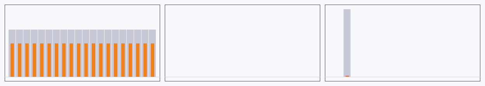

# Audio histogram quantization — M-MEDIA.8 / AUT-104

Turns an [`AudioChunk`](../api/media/audio/struct.AudioChunk.html)
into design-friendly rectangle bars for timeline / dope-sheet
visualization. Each
[`AudioBar`](../api/media/histogram/struct.AudioBar.html) carries
its window's start time, duration, peak, and RMS.



*Left to right: the same three mock sources as the
[mock-sources chapter](mock-sources.md), quantized at 50 ms buckets
over 1 s of audio.* Outer (light grey) extent = `peak`; inner
(amber) bar = `rms`. **Sine:** every bucket carries the same
height — constant amplitude. **Silence:** nothing. **Pulse:** one
bucket carries the spike (`peak = 1.0`), the rest are zero.

[api](../api/media/histogram/index.html)

## Math

| Metric | Formula | Range |
|---|---|---|
| `peak` | `max_{s in window}(|s|)` | `[0, 1]` |
| `rms`  | `sqrt(mean(s²))` | `[0, 1]` — for a pure sine of amplitude `A`, `rms ≈ A / √2` |

Multi-channel chunks **collapse to a single bar series** — every
sample in the interleaved buffer counts toward the same bucket. That
matches dope-sheet rendering (one row per audio track, not per
channel) and keeps the math + tests simple. M-MEDIA.9 (geometry)
handles mono vs stereo display modes.

## Bucket size

Default range is **20–50 ms** — dope-sheet readability sweet spot
(≈ 20–50 bars per second of audio). 10 ms is supported for tests +
zoom views.

Bucket-duration arithmetic uses the
[`MediaTime::from_sample`](../api/media/clock/struct.MediaTime.html#method.from_sample)
round-half-up path, so bar `start_time` values are exact — `bar[i+1]
.start = bar[i].start + bar[i].duration` for every `i`. No
gap-or-overlap drift across long captures.

## Quick start

```rust
use media::audio::{AudioChunk, AudioFormat};
use media::clock::{MediaDuration, MediaTime};
use media::histogram::quantize;
use media::mock_audio::SineWaveSource;

let fmt = AudioFormat::mono_f32(48_000);
let mut src = SineWaveSource::new(fmt, 1_000.0, 0.6);
let chunk = src.next_chunk(48_000);                       // 1 s
let h = quantize(&chunk, MediaDuration::from_millis(50)); // 20 bars
let expected = 0.6 / 2.0_f32.sqrt();
for bar in h.bars.iter().skip(1).take(18) {
    assert!((bar.rms - expected).abs() < 0.05);
}
```

## Three correctness assertions

M-MEDIA.4 (mock sources) lined up the three reference signals; this
chunk's tests verify the corresponding three histogram behaviors:

| Source | Histogram property |
|---|---|
| `SilenceSource` | All bars have `peak ≈ 0` and `rms ≈ 0`. |
| `SineWaveSource(A)` | Bars have `rms ≈ A/√2` (skip boundary cycles). |
| `StepPulseSource(K)` | One bar has `peak = 1.0` at the bucket containing frame `K`; all others `peak ≈ 0`. |

The same three mock sources will drive M-MEDIA.10 (Wisp render) and
M-MEDIA.11 (gst→histogram example) regression tests, so the
correctness chain is uniform across the audio-visualization stack.

## Tests

10 unit tests in `crates/media/src/histogram.rs::tests`. Bucket
counts at 10 ms / 20 ms / 50 ms, silence → zero bars, sine → stable
RMS, pulse → singular peak, empty chunk → empty histogram,
contiguous bar timestamps, stereo collapses to mono bar series,
`Send + Sync`. Full `just gate` green at 376 tests (366 + 10 new).

## Done when

- [x] Silence produces zero-amplitude bars.
- [x] Sine wave produces stable RMS.
- [x] Pulse produces expected peak.
- [x] Bucket count matches duration.
- [x] Tests cover 10 ms, 20 ms, 50 ms buckets.
- [x] Bar timestamps are contiguous.
- [x] Stereo chunks collapse to mono bar series.
- [x] mdBook chapter (this page).
- [x] `just gate` green.
