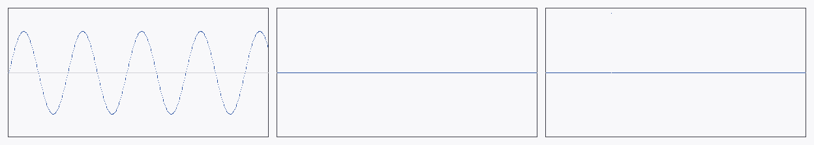

# Deterministic mock audio sources — M-MEDIA.4 / AUT-100

Three sources that emit timestamped [`AudioChunk`]s with byte-exact
reproducible samples — no microphone, no GStreamer. Every test that
wants "this is what audio looks like" without a live device uses one
of these.



*Left to right:* `SineWaveSource(440 Hz, A=0.7)` — five cycles
fitting the panel; `SilenceSource` — flat zero everywhere;
`StepPulseSource(120)` — a single 1.0 spike at frame 120, silent
otherwise. Rendered against a white backdrop per the CLAUDE.md
asset-choice rule (audio shape needs light backing to read).

[api](../api/media/mock_audio/index.html)

## The three shapes

| Source | Math | Used by |
|---|---|---|
| [`SineWaveSource`](../api/media/mock_audio/struct.SineWaveSource.html) | `amplitude · sin(2π·freq·t)` | M-MEDIA.8 RMS reference (RMS = A/√2), M-MEDIA.10 visual demo |
| [`SilenceSource`](../api/media/mock_audio/struct.SilenceSource.html) | All zeros | M-MEDIA.8 "this quantizes to zero bars" reference |
| [`StepPulseSource`](../api/media/mock_audio/struct.StepPulseSource.html) | Single 1.0 spike at a configured frame | M-MEDIA.8 peak-detection assertion |

Each source advances an internal frame counter on `next_chunk(frames)`
and stamps PTS via [`MediaTime::from_sample`]. Two successive
`next_chunk(48_000)` calls on a 48 kHz source produce chunks with
`pts = 0 s` and `pts = 1 s` — no rounding drift.

## Why three shapes

The histogram quantizer in M-MEDIA.8 has three correctness assertions:

1. **Silence → zero bars.** Trivial; `SilenceSource` is the input.
2. **Sine wave → stable RMS.** A pure sinusoid at amplitude A has RMS
   = A/√2 ≈ 0.7071·A. Constant across buckets. `SineWaveSource` is the
   input; the test asserts `(observed - A/√2).abs() < tolerance`.
3. **Pulse → expected peak.** A single 1.0 spike at frame K should
   show up as `peak == 1.0` exactly in the bucket containing frame K,
   and `peak < epsilon` everywhere else. `StepPulseSource` is the
   input.

These are the same three properties M-MEDIA.4 tests today, and the
same three M-MEDIA.8 will assert against the histogram output. Mock
sources let the entire audio-visualization stack be TDD'd before any
real audio infrastructure exists.

## Quick start

```rust
use media::audio::AudioFormat;
use media::mock_audio::{SineWaveSource, SilenceSource, StepPulseSource};

let fmt = AudioFormat::mono_f32(48_000);

// Sine wave at 440 Hz, amplitude 0.5. RMS ≈ 0.5 / √2.
let mut sine = SineWaveSource::new(fmt, 440.0, 0.5);
let chunk = sine.next_chunk(48_000); // 1 s
assert!((chunk.rms() - 0.5 / 2.0_f32.sqrt()).abs() < 0.01);

// 100 ms of silence.
let mut hush = SilenceSource::new(fmt);
assert!(hush.next_chunk(4_800).peak() < f32::EPSILON);

// Single spike at frame 7.
let mut pulse = StepPulseSource::new(fmt, 7);
let chunk = pulse.next_chunk(16);
assert!((chunk.samples()[7] - 1.0).abs() < f32::EPSILON);
```

## Done when

- [x] `SineWaveSource` emits expected sample count.
- [x] `SilenceSource` emits zeros.
- [x] `StepPulseSource` emits deterministic spike at the configured frame.
- [x] No GStreamer or device access required.
- [x] PTS advances correctly across multiple `next_chunk` calls.
- [x] Stereo interleave matches the `AudioChunk` planar-per-frame convention.
- [x] mdBook chapter (this page).
- [x] `just gate` green.
