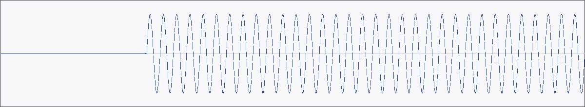

# A/V sync harness — M-MEDIA.7 / AUT-103

Combines [`GstreamerAudioCapture`](../api/media/gstreamer_audio/struct.GstreamerAudioCapture.html)
+ [`GstreamerVideoCapture`](../api/media/gstreamer_video/struct.GstreamerVideoCapture.html)
into one harness that reports per-stream timing and inter-stream
drift. With synthetic `audiotestsrc` + `videotestsrc` the assertion
stays deterministic — live capture (M-MEDIA.15 / .16) will reuse this
exact harness with `autoaudiosrc` / `autovideosrc`.

## The two streams the harness drives

<table>
<tr>
<td valign="top" width="50%">

<video controls muted loop playsinline width="320" src="../assets/media/video-capture.mp4">
  <a href="../assets/media/video-capture.mp4">video-capture.mp4</a>
</video>

*Video side — `videotestsrc` SMPTE colorbars (3 s, 320×240, 30 fps).*

</td>
<td valign="top" width="50%">

<audio controls preload="metadata" src="../assets/media/sample-audio.mp3">
  See `crates/media/tests/fixtures/sample-audio.mp3`.
</audio>



*Audio side — first 100 ms of the bundled 440 Hz MP3 fixture.*

</td>
</tr>
</table>

The harness pulls audio chunks (`audio_chunk_frames` per call —
4 800 frames / 100 ms at 48 kHz in the default config) and one video
frame per video tick until the configured `MediaDuration` is covered.
Both streams stamp their own PTS via
[`MediaTime`](../api/media/clock/struct.MediaTime.html); the
[`SyncReport`](../api/media/sync/struct.SyncReport.html) records the
**end-of-window** timestamp for each stream
(`chunk.pts + chunk.duration` for audio, `frame.pts + 1/fps` for
video) so the drift calculation is symmetric.

[api](../api/media/sync/index.html)

## What "drift" means here

Each stream stamps its own PTS via
[`MediaTime::from_sample`](../api/media/clock/struct.MediaTime.html#method.from_sample)
/ [`MediaTime::from_frame`](../api/media/clock/struct.MediaTime.html#method.from_frame).
For synthetic sources, both PTS values are derived from per-stream
counters at construction-time rates, so the per-stream PTS *is* the
timeline. The harness reports:

| Field | Meaning |
|---|---|
| `audio_frames` / `video_frames` | Cumulative captured. Expected = duration × rate. |
| `first_audio_pts` / `first_video_pts` | First-chunk / first-frame PTS. ≈ 0 s for synthetic sources. |
| `last_audio_pts` / `last_video_pts` | PTS of last captured chunk / frame. |
| `drift` | `|last_audio_pts − last_video_pts|`. Near-zero for synthetic; surfaces real clock disagreement for live capture. |

`SyncReport::drift_within(tolerance)` returns `bool` for assertion
ergonomics. `Display` formats a compact one-line summary.

## Quick start

```rust,no_run
use media::sync::{SyncConfig, run};
use media::clock::MediaDuration;

let report = run(SyncConfig::deterministic_1s())?;
println!("{report}");
assert!(report.drift_within(MediaDuration::from_millis(50)));
# Ok::<(), media::sync::Error>(())
```

## Configuration

[`SyncConfig::deterministic_1s`](../api/media/sync/struct.SyncConfig.html#method.deterministic_1s)
returns the default: 48 kHz mono audio + 64×36 30 fps video for 1
second. For longer captures (matches the AUT-103 ticket's 5–10 s
recommendation):

```rust,no_run
use media::audio::AudioFormat;
use media::clock::MediaDuration;
use media::sync::{SyncConfig, run};

let cfg = SyncConfig {
    audio_format: AudioFormat::stereo_f32(48_000),
    audio_frequency_hz: 1_000.0,
    video_width: 640,
    video_height: 360,
    video_framerate: 30,
    audio_chunk_frames: 4_800,
    duration: MediaDuration::from_seconds(5.0),
};
let report = run(cfg)?;
# Ok::<(), media::sync::Error>(())
```

## Integration tests

4 tests in `crates/media/tests/sync_harness_integration.rs`, each
skip-guarded via
[`media::gstreamer::is_available`](../api/media/gstreamer/fn.is_available.html):

| Test | Asserts |
|---|---|
| `deterministic_1s_capture_yields_expected_frame_counts` | 48 000 audio frames + 30 video frames after 1 s. |
| `deterministic_1s_first_pts_are_aligned_within_one_audio_chunk` | `|first_audio_pts − first_video_pts| < 100 ms`. |
| `deterministic_1s_drift_is_below_one_frame` | `drift < 1 / 25 s`. |
| `last_pts_values_are_below_capture_duration` | Neither stream's last PTS exceeds 1 s. |

## Manual regression

```bash
cargo run -p media --example gst_sync_dump  # planned follow-up
```

The integration tests run a 1-second capture for CI speed; the
ticket's recommended 5–10 s manual regression is left as the example
above.

## Done when

- [x] Captures audio and video for a fixed duration.
- [x] First audio/video PTS values are aligned within tolerance.
- [x] Drift over the capture window is measured + logged via `SyncReport::Display`.
- [x] Test uses deterministic synthetic sources (audiotestsrc + videotestsrc).
- [x] Skip-guarded when GStreamer is unavailable.
- [x] mdBook chapter (this page).
- [x] `just gate` green.
