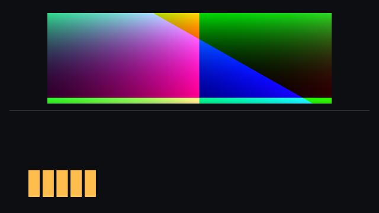
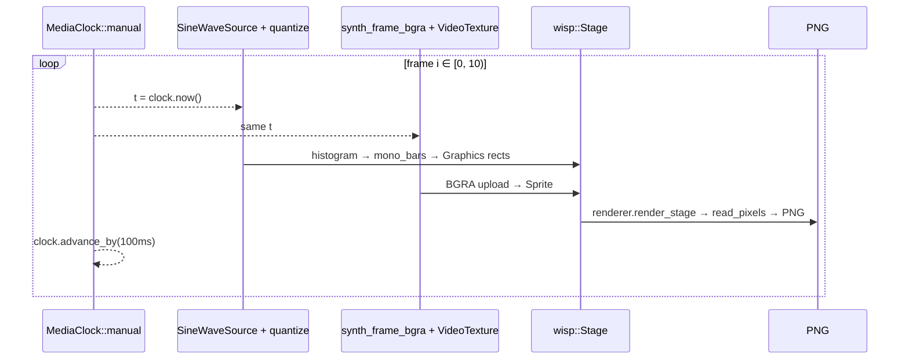

# Synced video + audio in one scene

[Linear: AUT-110](https://linear.app/harwood/issue/AUT-110)

The M-MEDIA P1 capstone. Video frames and an audio histogram render
in the same wisp scene, anchored to a single `MediaClock`. Every
seam shipped in M-MEDIA.0 through M-MEDIA.13 shows up at the same
call site:

- `MediaClock::manual` ([M-MEDIA.2](clock.md)) drives the timeline.
- `VideoFrame` ([M-MEDIA.12](video-texture.md)) uploads BGRA to a
  wisp `VideoTexture`.
- `SineWaveSource` → `AudioChunk` → `quantize` ([M-MEDIA.8](histogram.md))
  produces the histogram.
- `mono_bars` ([M-MEDIA.9](waveform-geometry.md)) lays the histogram
  out as rectangles.
- `wisp::Graphics` and `wisp::Sprite` draw both layers in one pass.



*Frame 5 of 10. Video occupies the top half (a hue-rotating gradient
that changes per frame); audio bars sit on the bottom (amber, scaled
to the chunk's peak). The amplitude ramps `0.30 → 0.90` over the run,
so bar heights grow monotonically frame-to-frame.*

## Per-frame loop



```admonish important title="One clock, two streams"
The example doesn't try to *generate* audio at the video's exact
PTS — it constructs a fresh `AudioChunk` per frame, anchored at
`clock.now()`, and quantizes it. Real captures (live mic + webcam,
M-MEDIA.15/.16) emit chunks with their own PTS; the recorder code
will pick the chunk whose window contains `clock.now()`. Either way,
**the clock is the single source of truth** — video and audio
align *against the clock*, not against each other.
```

## Run

```sh
cargo run -p media --example synced_scene
```

```text
frame 00: video.pts = 0.000 s | hist.window = [0.000 s, +20 ms ×  5 bars] amp=0.30 peak=0.300 rms=0.214
frame 01: video.pts = 0.100 s | hist.window = [0.100 s, +20 ms ×  5 bars] amp=0.37 peak=0.367 rms=0.261
…
frame 09: video.pts = 0.900 s | hist.window = [0.900 s, +20 ms ×  5 bars] amp=0.90 peak=0.900 rms=0.642
```

Ten 640×360 PNGs land under `target/synced-scene/frame_NN.png`.

## Reproducibility

```admonish note title="No GStreamer, no microphone"
Synthetic sources only. Every byte of every PNG is determined by
constants in `examples/synced_scene.rs` — `FRAME_PERIOD`,
`BUCKET`, the amplitude ramp, the hue-rotation step. Run it on
two machines with the same GPU and you'll get bit-identical
output. That's what makes this example viable as both a
manual-regression artifact and a future snapshot test.
```

## Manual regression

| Field | Expected |
| --- | --- |
| frame count | 10 PNGs at `target/synced-scene/frame_NN.png` |
| video.pts cadence | `0.000`, `0.100`, …, `0.900` s (100 ms steps) |
| hist.window stride | always `+20 ms`, 5 bars per window |
| amp ramp | `0.30 → 0.90` linearly, `peak ≈ amp`, `rms ≈ amp / √2` |
| visual | video changes color frame-to-frame; bars grow monotonically |

## What this unlocks

Live capture (M-MEDIA.15 / .16) swaps the synthetic sources for real
hardware-backed ones without changing the wisp side of the call.
Editor-UI integration (M-MEDIA.21) wires the same composition into
the Tauri shell. The scene shape doesn't change — only the data
sources do.
