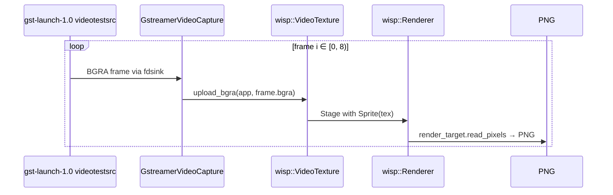

# GStreamer videotestsrc through Wisp

[Linear: AUT-109](https://linear.app/harwood/issue/AUT-109)

Real GStreamer frames through the same `VideoTexture` path that
M-MEDIA.12 stood up with synthetic frames. Closes the loop: the
recorder's video intake (M-MEDIA.6) feeds wisp's rendering pipeline
(M-MEDIA.12) end-to-end.


*Frame 0 of `videotestsrc`'s default SMPTE-colorbars pattern at
320×180, captured via the M-MEDIA.6 CLI-pipe wrapper, uploaded to a
wisp `VideoTexture`, and rendered through `Sprite`.*

## Run

```sh
cargo run -p media --example gst_video_to_wisp
```

Eight frames at 30 fps are captured and rendered. Output lands under
`target/gst-video-frames/frame_NN.png` with a per-frame PTS log:

```text
frame 00: pts = 0.000 s (         0 ns), index = 0
frame 01: pts = 0.033 s (  33333333 ns), index = 1
frame 02: pts = 0.067 s (  66666667 ns), index = 2
…
frame 07: pts = 0.233 s ( 233333333 ns), index = 7

Summary: 8 frames captured, 8 VideoTexture uploads,
         8 cumulative gst frames emitted.
```

## The wiring



```admonish important title="Build-time dep only on the example"
The `media` library never imports `wisp` or `wgpu`. The example
brings them in as **dev-dependencies** so `cargo run -p media
--example gst_video_to_wisp` works, but `cargo doc -p media` and
downstream consumers of the library don't pull wgpu into their tree.
The boundary stays clean.
```

## Manual regression

After running, verify:

| Field | Expected |
| --- | --- |
| PTS cadence    | `33_333_333` ns between frames (30 fps) |
| frame_index    | monotonic `0..8` |
| png count      | 8 files under `target/gst-video-frames/` |
| frame 0 content | SMPTE colorbars (white, yellow, cyan, green, magenta, red, blue stripes + noise band on top) |

Real-webcam capture (M-MEDIA.16) drops in here without any of the
wisp-side code changing. The video texture is format-agnostic at the
contract level — caps to BGRA on the GStreamer side, upload, render.

## Next

[Synced video + audio histogram in one Wisp scene](synced-scene.md) —
combines this video render with the M-MEDIA.10 audio histogram so the
two shows the recorder's two intake streams composed against one
timeline.
