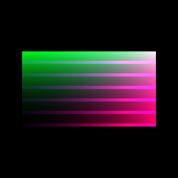
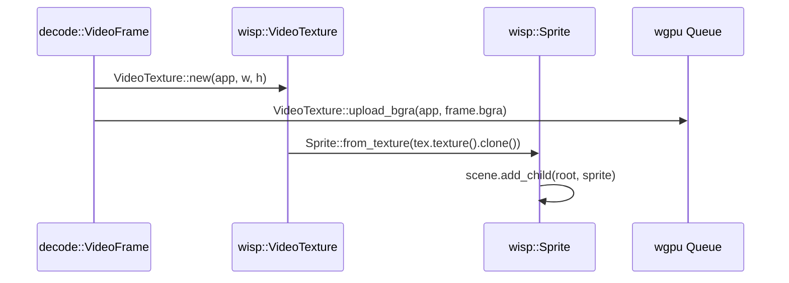

# Video texture handoff

[Linear: AUT-108](https://linear.app/harwood/issue/AUT-108)

The audio side of the seam (M-MEDIA.9–11) emits `Vec<WaveformBarRect>`
geometry; the video side emits raw BGRA bytes. wisp's
[`VideoTexture`](../api/wisp/texture/video_texture/struct.VideoTexture.html)
already knew how to receive them — this chunk formalizes the call
site as a story so future code can copy the pattern.



A 128×72 synthetic [`VideoFrame`](../api/media/struct.VideoFrame.html)
(diagonal gradient + horizontal stripes) uploaded to a
`VideoTexture` and drawn through the standard `Sprite` pipeline.

## Handoff path



```admonish important title="wisp doesn't know the source"
`VideoTexture::upload_bgra` takes a `&[u8]` and dimensions — that's
the entire API surface. The bytes can come from a GStreamer pipe,
ScreenCaptureKit on macOS, the Windows duplication API, a synthetic
gradient, or a file. `wisp` doesn't have a `media::VideoFrame`
import, and it won't grow one. Crossing that boundary is the whole
point of the `media` crate.
```

## Story code (excerpt)

```rust
use media::VideoFrame;
use wisp::texture::video_texture::VideoTexture;
use wisp::Sprite;

let video_tex = VideoTexture::new(app, frame.width, frame.height);
video_tex.upload_bgra(app, &frame.bgra);

let mut sprite = Sprite::from_texture(video_tex.texture().clone());
sprite.container.transform.scale = Vec2::new(1.5, 1.5 * 72.0 / 128.0);
let _ = stage.add_child(stage.root(), sprite);
```

Full story:
[`s_video_frame_handoff.rs`](../api/wisp_storybook/index.html).

```admonish note title="BGRA is wgpu's native pixel order"
`Bgra8UnormSrgb` is the texture format `VideoTexture` allocates — no
shader-side swizzle, no per-frame CPU pass to reorder bytes.
ScreenCaptureKit, Windows duplication, and gst-launch's `videoconvert
! video/x-raw,format=BGRA` pipeline all hand BGRA over the wire. If
your source is RGBA, an extra `videoconvert` stage in the GStreamer
pipeline (or a one-line shuffle in Rust) is the bridge.
```

## Determinism

The synthetic frame depends only on `(width, height)`, so the
rendered PNG is identical run-to-run on the same GPU. Story is
covered by `story_smoke` (no validation errors + visible pixels)
and `story_fingerprints` (quadrant snapshot). Upload-orientation,
format-byte-order, and colorspace regressions trip the snapshot
because the gradient + stripe pattern has enough per-quadrant
variance to detect them.

## Next

[GStreamer video test source through Wisp](video-render.md) — swaps
the synthetic frame for a real `videotestsrc` frame served via the
existing M-MEDIA.6 capture pipeline.
