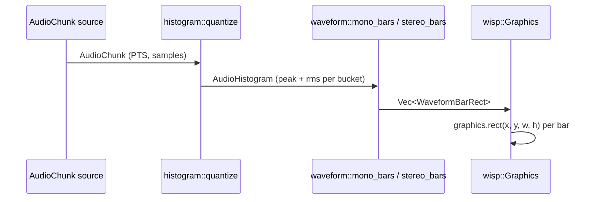

# Waveform bar geometry

[Linear: AUT-105](https://linear.app/harwood/issue/AUT-105)

Maps an
[`AudioHistogram`](../api/media/histogram/struct.AudioHistogram.html)
to a list of axis-aligned rectangles that `wisp`'s graphics pipeline
can render directly.

```admonish important title="Boundary rule"
`wisp` must not know about audio. `media` (this crate) produces typed
geometry — `Vec<WaveformBarRect>` — and `wisp` draws those rectangles
with its existing graphics pipeline. Without this seam, every wisp
consumer (storybook, headless export, future plugins) would pull in
GStreamer's build + license footprint.
```

[api](../api/media/waveform/index.html)

## Data flow



The histogram carries timing on a media timeline (each bar has
`start_time` + `duration`); the geometry stage drops timing and lays
bars out by **index**, with `bar_width + bar_gap` between adjacent
left edges. Timeline-aligned layout (dope-sheet, scrubber) is the
caller's job — this module is unit-agnostic.

## Coordinate convention

Rectangles use a `y`-up convention (matching wisp NDC): `x` / `y` is
the **bottom-left** corner, `width` / `height` are non-negative.
Layout values use whatever unit the caller picks — NDC `[-1, +1]`,
screen pixels, normalized `[0, 1]`. The math doesn't care.

## Two display modes

```admonish note title="Anchored vs Mirrored"
Mono histograms get two layout styles:
- **Anchored** — bar's bottom edge sits on `baseline_y`, grows up by
  `value × max_height`. Use for dope-sheet rows above a timeline.
- **Mirrored** — bar centered on `baseline_y`, extends half up and
  half down. Use for centered "VU-style" displays.

Stereo always uses anchored geometry: left grows up from
`baseline_y`, right grows down. The `mode` field is ignored.
```

## Quick start

```rust
use media::{
    audio::AudioFormat, clock::MediaDuration, histogram::quantize,
    mock_audio::SineWaveSource, waveform::{mono_bars, WaveformLayout},
};

let mut src = SineWaveSource::new(AudioFormat::mono_f32(48_000), 440.0, 0.6);
let chunk = src.next_chunk(48_000);                       // 1 s
let h = quantize(&chunk, MediaDuration::from_millis(50)); // 20 bars
let rects = mono_bars(&h, &WaveformLayout::ndc_default());
// rects.len() == 20; each rect.height == bar.peak * 0.4
```

## Manual regression — four-bar table

A test crafts a 4-bar histogram with `peak = [1.0, 0.5, 0.25, 0.0]`,
lays it out anchored at `y = 0`, `bar_width = 0.1`, `bar_gap = 0.02`,
`max_height = 1.0`, `origin_x = 0.0`. Expected geometry:

| Bar | `peak` | `x`    | `y` | `width` | `height` |
| --- | ------ | ------ | --- | ------- | -------- |
| 0   | 1.00   | `0.00` | `0` | `0.10`  | `1.00`   |
| 1   | 0.50   | `0.12` | `0` | `0.10`  | `0.50`   |
| 2   | 0.25   | `0.24` | `0` | `0.10`  | `0.25`   |
| 3   | 0.00   | `0.36` | `0` | `0.10`  | `0.00`   |

Stride = `bar_width + bar_gap = 0.12`. Height = `peak × max_height`.
The bar-4 zero-height rect is preserved (geometry stays parallel to
histogram order) so downstream renderers can use stable indices.

## Next

[Render synthetic audio histogram in Wisp](histogram-render.md) takes
this geometry list and draws it through `wisp::Graphics` for the
first time.
