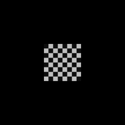
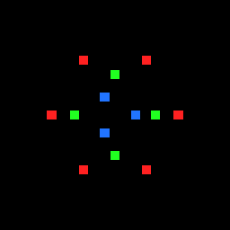
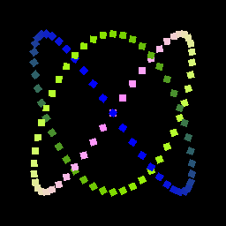
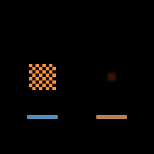
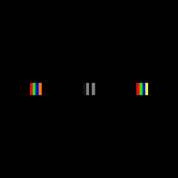
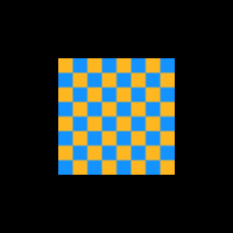

# M0 — `wisp` renderer

21 chunks. Stage, transforms, sprites, graphics, text, filters, mesh.
Complete; full chunk-by-chunk write-up in `_docs/milestone-0-renderer.md`.

Every chunk's renderable output is captured in
[`wisp` stories](../wisp/stories.md). Selected highlights:

| Chunk | Feature | Asset |
|---|---|---|
| M0.5 | Hello quad |  |
| M0.7 | Transform nesting |  |
| M0.10 | Sprite batcher |  |
| M0.13 | Bitmap text |  |
| M0.16 | Graphics (rounded) |  |
| M0.16 | Graphics (gradients) |  |
| M0.17 | Blur filter |  |
| M0.17 | Drop shadow |  |
| M0.18 | Motion blur |  |
| M0.18 | Color matrix |  |
| M0.19 | 3D mesh perspective |  |
