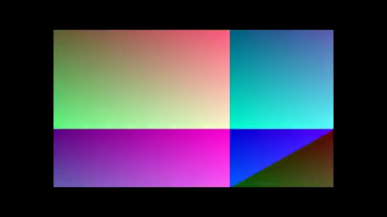
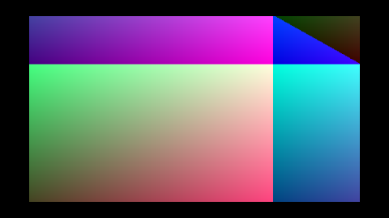
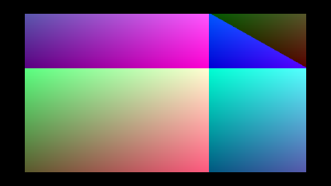
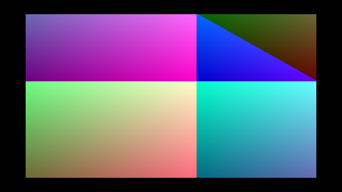
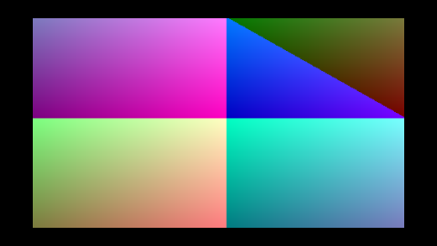
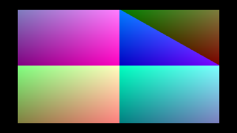

# `playback` — overview

The middle layer between [`decode`](../decode/overview.md) and
[`wisp`](../wisp/overview.md). `Player` owns a boxed `VideoStream` and a
`VideoTexture`, and pumps decoded frames into the GPU at the source's
frame rate while the shell ticks it once per render frame.

## Contract

```mermaid
sequenceDiagram
    participant Shell as Shell<br/>(Tauri / winit)
    participant Player
    participant Stream as Box&lt;dyn VideoStream&gt;<br/>(decode crate)
    participant Texture as VideoTexture<br/>(wisp crate)
    participant Sprite as wisp::Sprite

    loop once per render frame
        Shell ->> Player: tick(dt)
        Note over Player: if Playing,<br/>elapsed += dt
        loop while elapsed ≥ next_due
            Player ->> Stream: next_frame()
            Stream -->> Player: VideoFrame (BGRA)
            Player ->> Texture: upload_bgra(&frame.bgra)
            Note over Player: next_due +=<br/>1.0 / frame_rate()
        end
        Player -->> Shell: frames_uploaded: u32
        Note over Shell: redraw only when<br/>frames_uploaded > 0
        Sprite ->> Texture: sample (on screen)
    end
```

`tick` returns the number of frames it actually uploaded so the shell
can drive a redraw signal off it (no re-render needed when no new frame
is due).

## Transport

| State | What `tick` does |
|---|---|
| `Paused` (default) | nothing — `elapsed` stays put, texture serves the last uploaded frame |
| `Playing` | normal pump |
| `Ended` | nothing — same as `Paused` but the UI can swap "Pause" → "Replay" |

## Anti-regression contract (tests in `tests/timing.rs`)

- Paused player does not advance — `elapsed == 0` after a 1 s tick.
- First tick uploads the t=0 frame even with a 1 ms `dt` (no off-by-one
  causing the first frame to be skipped).
- 1 s of wallclock at 60 Hz render against a 30 fps source pulls
  ~30 frames (29..=31 inclusive — boundary tolerance is documented).
- Stream exhaustion transitions to `Ended` cleanly.
- Pause freezes both the state *and* the texture (next `tick` does not
  re-upload the held frame).
- `duration_hint` matches `frame_count / frame_rate`.

## Visual proof — 30 ticks of the timed_playback example

Run with:

```
cargo run -p playback --example timed_playback
```

Each tick where the player uploaded a frame is captured below — that's
the gradient phase advancing across 1 s of wallclock as the player
catches the timestamps that come due.

| Tick 00 | Tick 02 | Tick 04 | Tick 06 |
|---|---|---|---|
|  |  |  |  |

| Tick 11 | Tick 21 | Tick 31 | Tick 41 |
|---|---|---|---|
|  |  |  |  |

| Tick 49 | Tick 53 | Tick 57 | Tick 59 |
|---|---|---|---|
|  |  |  |  |

[Player API](../api/playback/struct.Player.html) ·
[`PlayState`](../api/playback/enum.PlayState.html)
